---
## Front matter
title: "Лабораторная работа №1"
subtitle: "дисциплина: Архитектура компьютеров"
author: "Безходарнова Алиса Викторовна"

## Generic options
lang: ru-RU
toc-title: "Содержание"

## Bibliography
bibliography: bib/cite.bib
csl: pandoc/csl/gost-r-7-0-5-2008-numeric.csl

## Pdf output format
toc: true # Table of contents
toc-depth: 2
lof: true # List of figures
lot: true # List of tables
fontsize: 12pt
linestretch: 1.5
papersize: a4
documentclass: scrreprt
## I18n polyglossia
polyglossia-lang:
  name: russian
  options:
  - spelling=modern
  - babelshorthands=true
polyglossia-otherlangs:
  name: english
## I18n babel
babel-lang: russian
babel-otherlangs: english
## Fonts
mainfont: IBM Plex Serif
romanfont: IBM Plex Serif
sansfont: IBM Plex Sans
monofont: IBM Plex Mono
mathfont: STIX Two Math
mainfontoptions: Ligatures=Common,Ligatures=TeX,Scale=0.94
romanfontoptions: Ligatures=Common,Ligatures=TeX,Scale=0.94
sansfontoptions: Ligatures=Common,Ligatures=TeX,Scale=MatchLowercase,Scale=0.94
monofontoptions: Scale=MatchLowercase,Scale=0.94,FakeStretch=0.9
mathfontoptions:
## Biblatex
biblatex: true
biblio-style: "gost-numeric"
biblatexoptions:
  - parentracker=true
  - backend=biber
  - hyperref=auto
  - language=auto
  - autolang=other*
  - citestyle=gost-numeric
## Pandoc-crossref LaTeX customization
figureTitle: "Рис."
lofTitle: "Список иллюстраций"
## Misc options
indent: true
header-includes:
  - \usepackage{indentfirst}
  - \usepackage{float} # keep figures where there are in the text
  - \floatplacement{figure}{H} # keep figures where there are in the text
---
# Цель работы

Целью данной работы является приобретение практических навыков установки операционной системы на виртуальную машину, настройки минимально необходимых для дальнейшей работы сервисов.

# Задание

- Установить Linux на виртуальную машину
- Настроить операционную систему

# Теоретическое введение

Linux — это
семейство свободных UNIX-подобных операционных систем с открытым исходным кодом, базирующихся на одноимённом ядре (созданном Линусом Торвальдсом в 1991 году). Linux отличается высокой надежностью, безопасностью и гибкостью, используется на серверах, суперкомпьютерах, Android-устройствах, встраиваемой технике и ПК.

# Выполнение лабораторной работы

Устаавливаю ОС на свою виртуальную машину (рис. -@fig:001).

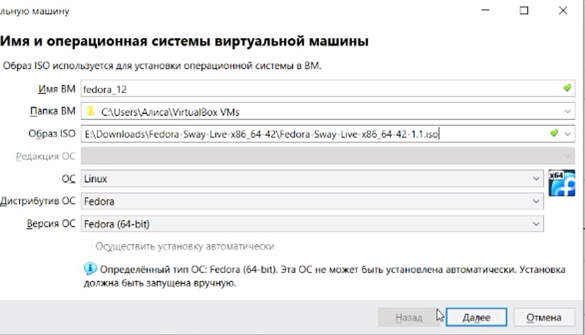{#fig:01 width=70%}

Устанавливаю файлы на жесткий диск и задаю параметры (рис. -@fig:002).

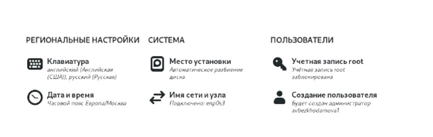{#fig:002 width=70%}

Устанавливаю средства разработки (Рис -@fig:003).

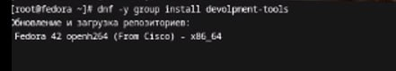{#fig:003 width=70%}

И  (Рис -@fig:004) 

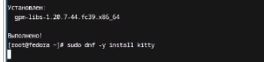{#fig:004 width=70%}

Отключаю SELinux (Рис. -@fig:005) 

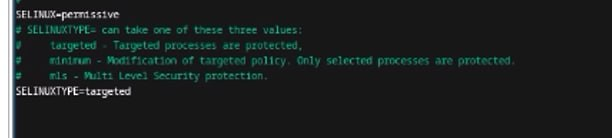{#fig:005 width=70%}

Создаю конфигурационный файл (Рис -@fig:006) 

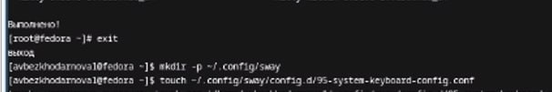{#fig:006 width=70%}

И редактирую раскладки клавиатуры (Рис -@fig:007) 

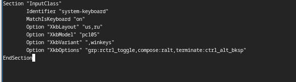{#fig:007 width=70%}

Устанавливаю pandoc-crossref (Рис -@fig:008) 

{#fig:008 width=70%}

Устанавливаю pandoc и pandoc-crossref, а также помещаю их в каталог (Рис.-@fig:009)

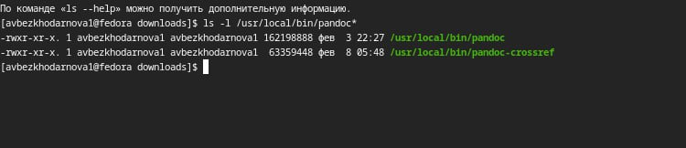{#fig:009 width=70%}

Устанавливаю texlive (Рис. -@fig:010) 

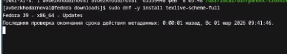{#fig:010 width=70%}

И убеждаюсь, что оно установилось (Рис -@fig:011)

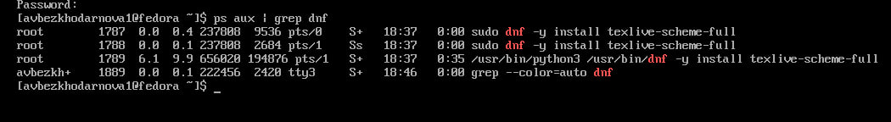{#fig:011 width=70%}

# Домашнее задание

Ввожу команды в терминал (Рис. -@fig:012)

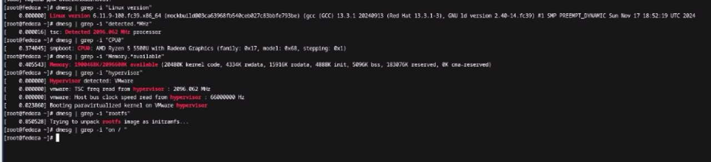{#fig:012 width=70%}

# Вывод

В ходе данной лабораторной работы я научилась устанавливать Linux,а также настраивать ее для дальнейшей работы.

# Контрольные вопросы

1. Учётная запись пользователя содержит идентификационную и служебную информацию: имя пользователя, зашифрованный пароль (или ссылку на него), числовой идентификатор пользователя (UID), числовой идентификатор основной группы (GID), комментарий (обычно ФИО), путь к домашнему каталогу и командную оболочку, назначаемую при входе.

2. Команды терминала
a) Для получения справки по команде:
· man
· --help
b) Для перемещения по файловой системе:
· cd
c) Для просмотра содержимого каталога:
· ls
d) Для определения объёма каталога:
· du
e) Для создания / удаления каталогов / файлов:
-  mkdir (создание каталога)
-  touch (создание файла)
-  rmdir (удаление пустого каталога)
- rm (удаление файла или каталога)
f) Для задания определённых прав на файл / каталог:
- chmod
g) Для просмотра истории команд:
- history

3.  Файловая система — это метод и структура данных, определяющие способ организации, хранения и именования данных на носителе информации. Она управляет доступом к файлам и распределением места.
Примеры:

-  ext4: Журналируемая файловая система, стандартная для многих дистрибутивов Linux. Поддерживает большие файлы и тома, обладает высокой производительностью и надежностью.
- XFS: Высокопроизводительная журналируемая файловая система, оптимизированная для параллельных операций и работы с большими файлами. Часто используется в серверных решениях.
- btrfs: Современная файловая система с поддержкой снапшотов, сжатия и проверки целостности данных (механизм copy-on-write).
- NTFS: Журналируемая файловая система семейства Windows, поддерживающая большие тома, разграничение прав доступа и шифрование.

4.  Для просмотра подмонтированных файловых систем используются команды mount (без аргументов) или df. Информация также доступна в файле /etc/mtab.

5. Для удаления зависшего процесса необходимо определить его идентификатор (PID) с помощью команд ps или top, после чего отправить ему сигнал завершения командой kill. В случае если процесс не реагирует на стандартный запрос завершения, используется принудительный сигнал с опцией -9.

# Список литературы{.unnumbered}

