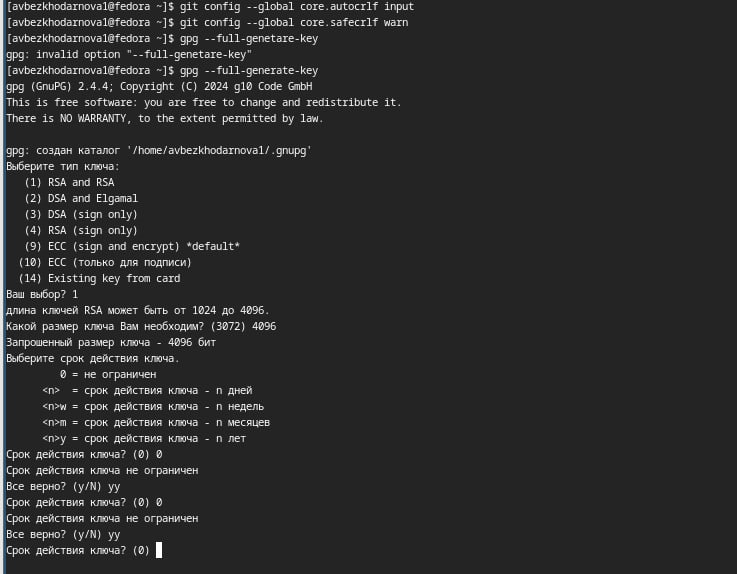
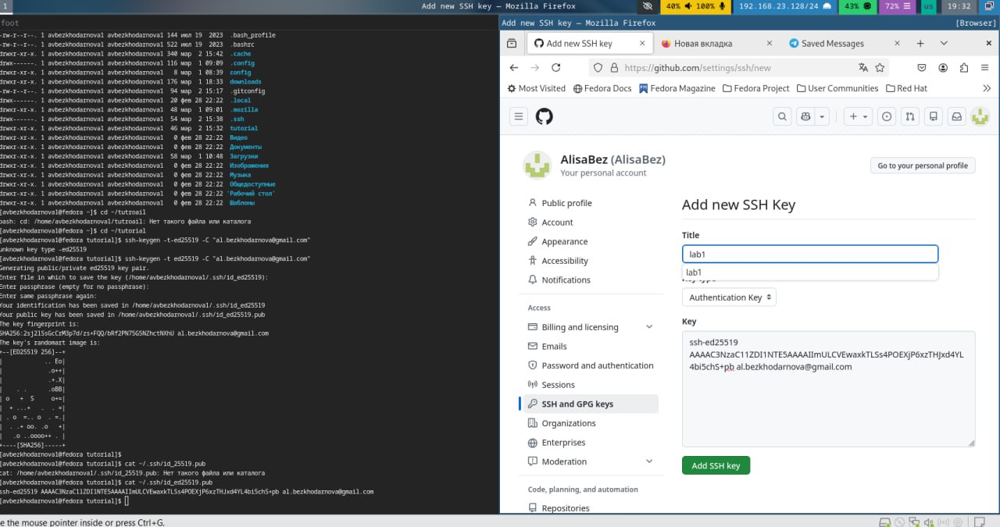
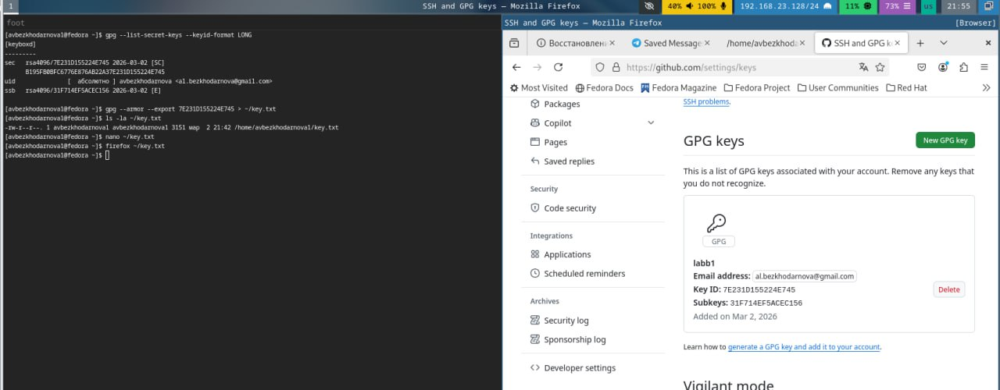
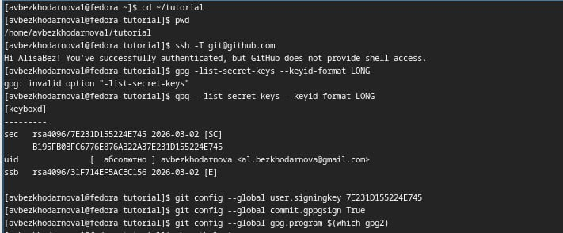
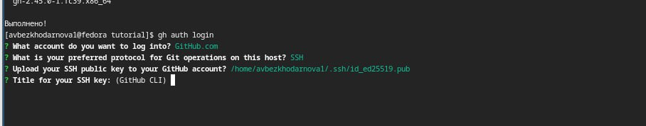
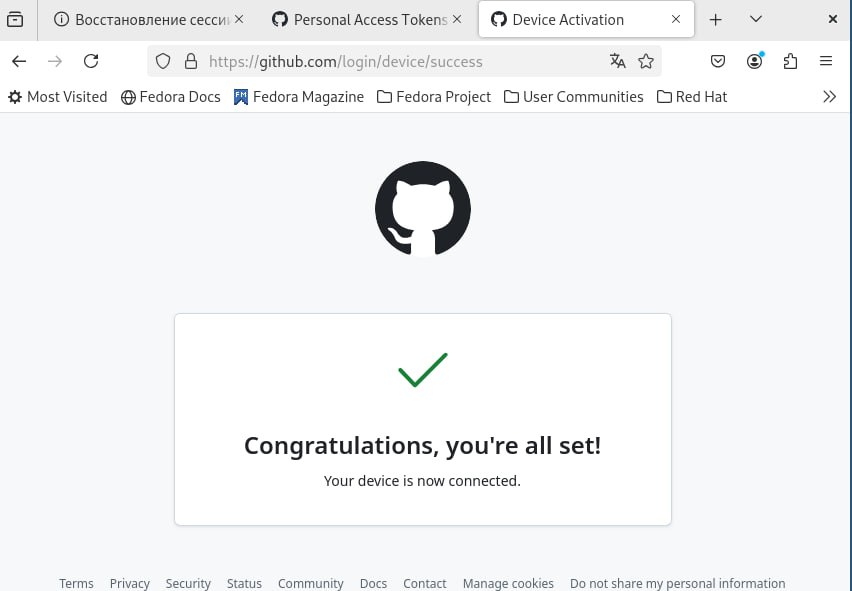
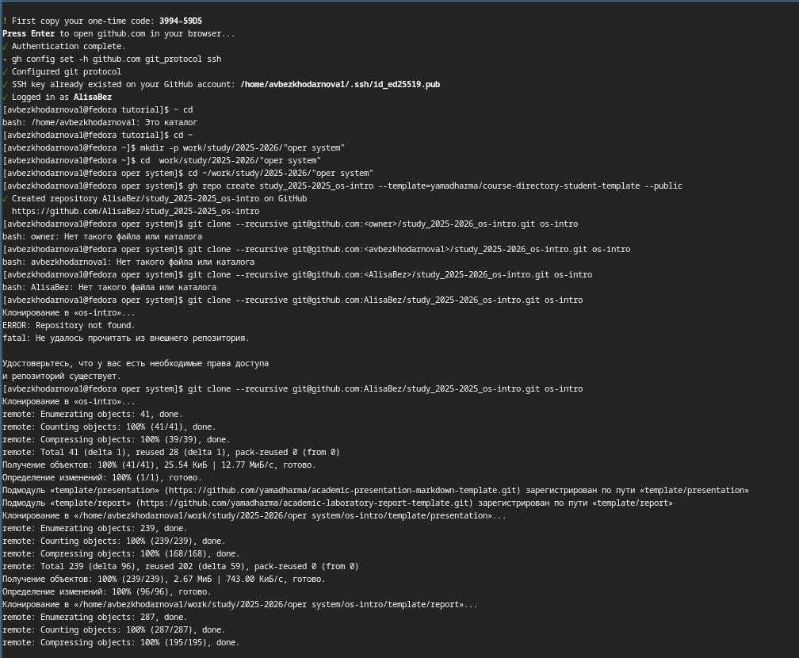
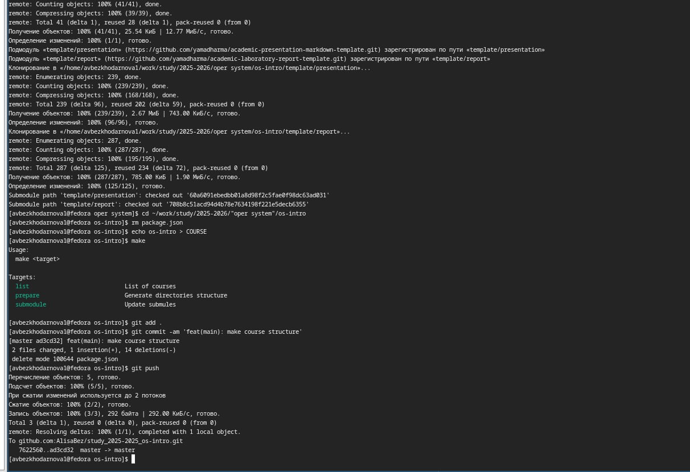

---
## Front matter
title: "Лабораторная работа №2"
subtitle: "дисциплина: Архитектура компьютера"
author: "Безходарнова Алиса Викторовна"

## Generic options
lang: ru-RU
toc-title: "Содержание"

## Bibliography
bibliography: bib/cite.bib
csl: pandoc/csl/gost-r-7-0-5-2008-numeric.csl

## Pdf output format
toc: true # Table of contents
toc-depth: 2
lof: true # List of figures
lot: true # List of tables
fontsize: 12pt
linestretch: 1.5
papersize: a4
documentclass: scrreprt
## I18n polyglossia
polyglossia-lang:
  name: russian
  options:
  - spelling=modern
  - babelshorthands=true
polyglossia-otherlangs:
  name: english
## I18n babel
babel-lang: russian
babel-otherlangs: english
## Fonts
mainfont: IBM Plex Serif
romanfont: IBM Plex Serif
sansfont: IBM Plex Sans
monofont: IBM Plex Mono
mathfont: STIX Two Math
mainfontoptions: Ligatures=Common,Ligatures=TeX,Scale=0.94
romanfontoptions: Ligatures=Common,Ligatures=TeX,Scale=0.94
sansfontoptions: Ligatures=Common,Ligatures=TeX,Scale=MatchLowercase,Scale=0.94
monofontoptions: Scale=MatchLowercase,Scale=0.94,FakeStretch=0.9
mathfontoptions:
## Biblatex
biblatex: true
biblio-style: "gost-numeric"
biblatexoptions:
  - parentracker=true
  - backend=biber
  - hyperref=auto
  - language=auto
  - autolang=other*
  - citestyle=gost-numeric
## Pandoc-crossref LaTeX customization
figureTitle: "Рис."
tableTitle: "Таблица"
listingTitle: "Листинг"
lofTitle: "Список иллюстраций"
lotTitle: "Список таблиц"
lolTitle: "Листинги"
## Misc options
indent: true
header-includes:
  - \usepackage{indentfirst}
  - \usepackage{float} # keep figures where there are in the text
  - \floatplacement{figure}{H} # keep figures where there are in the text
---
# Цель работы

Изучить идеологию и применение средств контроля версий.
Освоить умения по работе с git.

# Задание

Создать базовую конфигурацию для работы с git.
Создать ключ SSH.
Создать ключ PGP.
Настроить подписи git.
Зарегистрироваться на Github.
Создать локальный каталог для выполнения заданий по предмету.

# Теоретическое введение
Системы контроля версий (Version Control System, VCS) применяются при работе нескольких человек над одним проектом. Обычно основное дерево проекта хранится в локальном или удалённом репозитории, к которому настроен доступ для участников проекта. При внесении изменений в содержание проекта система контроля версий позволяет их фиксировать, совмещать изменения, произведённые разными участниками проекта, производить откат к любой более ранней версии проекта, если это требуется.
В классических системах контроля версий используется централизованная модель, предполагающая наличие единого репозитория для хранения файлов. Выполнение большинства функций по управлению версиями осуществляется специальным сервером. Участник проекта (пользователь) перед началом работы посредством определённых команд получает нужную ему версию файлов. После внесения изменений, пользователь размещает новую версию в хранилище. При этом предыдущие версии не удаляются из центрального хранилища и к ним можно вернуться в любой момент. Сервер может сохранять не полную версию изменённых файлов, а производить так называемую дельта-компрессию — сохранять только изменения между последовательными версиями, что позволяет уменьшить объём хранимых данных.
Системы контроля версий поддерживают возможность отслеживания и разрешения конфликтов, которые могут возникнуть при работе нескольких человек над одним файлом. Можно объединить (слить) изменения, сделанные разными участниками (автоматически или вручную), вручную выбрать нужную версию, отменить изменения вовсе или заблокировать файлы для изменения. В зависимости от настроек блокировка не позволяет другим пользователям получить рабочую копию или препятствует изменению рабочей копии файла средствами файловой системы ОС, обеспечивая таким образом, привилегированный доступ только одному пользователю, работающему с файлом.
Системы контроля версий также могут обеспечивать дополнительные, более гибкие функциональные возможности.Например, они могут поддерживать работу с несколькими версиями одного файла, сохраняя общую историю изменений до точки ветвления версий и собственные истории изменений каждой ветви. Кроме того, обычно доступна информация о том, кто из участников, когда и какие изменения вносил. Обычно такого рода информация хранится в журнале изменений, доступ к которому можно ограничить.
В отличие от классических, в распределённых системах контроля версий центральный репозиторий не является обязательным. Среди классических VCS наиболее известны CVS, Subversion, а среди распределённых — Git, Bazaar, Mercurial. Принципы их работы схожи, отличаются они в основном синтаксисом используемых в работе команд.

# Выполнение лабораторной работы

Выполняю базовую настройку git (рис. -@fig:git-config).

{#fig:git-config width=70%}

Создаю ключ ssh (рис. -@fig:ssh).

{#fig:ssh width=60%}

Создаю ключ gpg (Рис -@fig:gpg).

{#fig:gpg width=70%}

Получаю ключи и подключаю их к гитхабу  (Рис -@fig:git) 

{#fig:git width=70%)

И (Рис. -@fig:gitt) 

{#fig:gitt width=70%}

Настраиваю автоматические подписи (Рис -@fig:006) 

{#fig:006 width=70%}

Авторизуюсь на гитхаб через терминал (Рис -@fig:007) 

{#fig:007 width=70%)

И (Рис -@fig:008) 

{#fig:008 width=70%}

Создаю директорию курса через шаблон (Рис.-@fig:009)

{#fig:009 width=70%}

И настраиваю рабочую директорию (Рис. -@fig:010) 

{#fig:010 width=70%}

# Вывод

В ходе данной лабораторной работы я изучала идеологию и применение средств контроля версий, а также освоила работу с git

# Контрольные вопросы

1. Что такое системы контроля версий (VCS) и для решения каких задач они предназначаются?
Системы контроля версий применяются при работе нескольких человек над одним проектом. Они позволяют фиксировать изменения, совмещать изменения разных участников, производить откат к любой более ранней версии проекта.
2. Объясните следующие понятия VCS и их отношения: хранилище, commit, история, рабочая копия.
Хранилище — место хранения всех файлов проекта и истории изменений (в Git это папка .git).
Commit — операция сохранения изменений в репозитории.
История — последовательность коммитов, отражающая все изменения проекта.
Рабочая копия — файлы проекта на локальном компьютере, с которыми непосредственно работает пользователь.
3. Что представляют собой и чем отличаются централизованные и децентрализованные VCS? Приведите примеры VCS каждого вида.
В классических системах используется централизованная модель, предполагающая наличие единого репозитория для хранения файлов. Выполнение большинства функций по управлению версиями осуществляется специальным сервером. Примеры: CVS, Subversion.
В отличие от классических, в распределённых системах контроля версий центральный репозиторий не является обязательным. Примеры: Git, Bazaar, Mercurial.
4. Опишите действия с VCS при единоличной работе с хранилищем.
Инициализация репозитория (git init), создание и изменение файлов, добавление их в индекс (git add), фиксация изменений (git commit).
5. Опишите порядок работы с общим хранилищем VCS.
Получение актуальной версии из центрального репозитория (git pull), создание новой ветки (git checkout -b имя_ветки), внесение изменений, добавление (git add) и фиксация (git commit), отправка изменений в центральный репозиторий (git push origin имя_ветки).
6. Каковы основные задачи, решаемые инструментальным средством git?
Управление версиями, обеспечение совместной работы над проектом, возможность отката к любой предыдущей версии, поддержка ветвления и слияния.
7.
Назовите и дайте краткую характеристику командам git.
git init — создание нового репозитория

git add — добавление изменений в индекс

git commit — фиксация изменений

git push — отправка изменений в удалённый репозиторий

git pull — получение изменений из удалённого репозитория

git status — просмотр состояния файлов

git log — просмотр истории коммитов

git checkout — переключение между ветками

git branch — управление ветками

git merge — слияние веток
8. Приведите примеры использования при работе с локальным и удалённым репозиториями.
Локальный репозиторий:
mkdir tutorial; cd tutorial; git init; echo 'hello world' > hello.txt; git add hello.txt; git commit -am 'Новый файл'
Удалённый репозиторий:
git remote add origin ssh://git@github.com/username/reponame.git; git push -u origin master
9. Что такое и зачем могут быть нужны ветви (branches)?
Ветви позволяют вести параллельную разработку, изолировать изменения, экспериментировать, не затрагивая основную версию проекта, а затем объединять изменения через слияние.
10. Как и зачем можно игнорировать некоторые файлы при commit?
Для этого создаётся файл .gitignore, в который прописываются шаблоны файлов и каталогов (например, *.tmp, *.o, build/), которые не должны попадать в репозиторий. Это позволяет исключить временные файлы, объектные файлы, создаваемые компиляторами, и другие служебные данные.

# Список литературы{.unnumbered}

