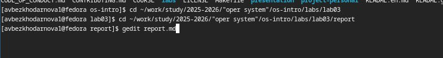
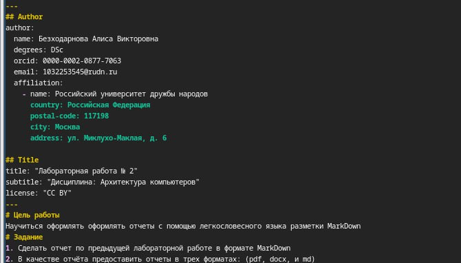

---
## Front matter
lang: ru-RU
title: Лабораторная работа №2
subtitle: Архитектура компьютеров
author:
  - Безходарнова А.В.
institute:
  - Российский университет дружбы народов, Москва, Россия
date: 06 марта 2026

## i18n babel
babel-lang: russian
babel-otherlangs: english

## Fonts
mainfont: Liberation Serif
sansfont: Liberation Sans
monofont: Liberation Mono

## Formatting pdf
toc: false
toc-title: Содержание
slide_level: 0
aspectratio: 169
section-titles: true
theme: metropolis
header-includes:
  - \metroset{progressbar=frametitle,sectionpage=progressbar,numbering=fraction}
---

# Информация

## Докладчик

:::::::::::::: {.columns align=center}
::: {.column width="70%"}

  * Безходарнова Алиса Викторовна
  * Студентка НКАбд-01-25
  * Алiса
  * Российский университет дружбы народов
  * [1032253545@rudn.ru](mailto1032253545@rudn.ru)

:::
::: {.column width="30%"}

:::
::::::::::::::

# Цель работы

Научиться оформлять отчёты с помощью легковесного языка разметки Markdown.

# Задание

Сделать отчёт по предыдущей лабораторной работе в формате Markdown.
В качестве отчёта предоставить отчёты в 3 форматах: pdf, docx и md 

# Актуальность темы.

Язык разметки Markdown широко используется в современной научной и технической среде для создания структурированных текстов, документации и отчётов благодаря своей простоте и удобству преобразования в различные форматы.

# Объект и предмет исследования.

Объектом исследования является язык разметки Markdown, а предметом — его синтаксис и возможности применения для оформления отчётов по лабораторным работам.

# Научная новизна.

Новизна работы заключается в систематизации базовых конструкций Markdown и их адаптации для подготовки отчётов в рамках учебного процесса.

# Практическая значимость работы.

Практическая значимость работы состоит в формировании навыков оформления отчётов в формате Markdown с последующей компиляцией в PDF и DOCX, что необходимо для выполнения лабораторных работ и дальнейшей учебной деятельности.

# Теоретическое введение

Чтобы создать заголовок, используйте знак ( # ). Чтобы задать для текста полужирное начертание, заключите его в двойные звездочки. Чтобы задать для текста курсивное начертание, заключите его в одинарные звездочки. Чтобы задать для текста полужирное и курсивное начертание, заключите его в тройные звездочки.
Блоки цитирования создаются с помощью символа >. Неупорядоченный (маркированный) список можно отформатировать с помощью звез- дочек или тире.
Чтобы вложить один список в другой, добавьте отступ для элементов дочернего
списка. Упорядоченный список можно отформатировать с помощью соответствующих цифр. Чтобы вложить один список в другой, добавьте отступ для элементов дочернего списка. Синтаксис Markdown для встроенной ссылки состоит из части
[link text] , представ- ляющей текст гиперссылки, и части (file-name.md) – URLадреса или имени файла, на который дается ссылка. Markdown поддерживает как встраивание фрагментов кода в предложение, так и их размещение между
предложениями в виде отдельных огражденных блоков. Огражденные блоки
кода — это простой способ выделить синтаксис для фрагментов кода. Внутритекстовые формулы делаются аналогично формулам LaTeX. Для обработки файлов в формате Markdown будем использовать Pandoc. Конкретно, нам понадобится программа pandoc , pandoc-citeproc https://github.com/jgm/pandoc/releases, pandoccrossref https://github.com/lierdakil/pandoc-crossref/releases. Преобразовать файл
README.md можно следующим образом: 1 pandoc README.md -o README.pdf
или так 1 pandoc README.md -o README.docx Можно использовать следующий
Makefile 1 FILES = $(patsubst %.md, %.docx, $(wildcard .md)) 2 FILES += $(patsubst %.md,
%.pdf, $(wildcard .md))

# Выполнение лабораторной работы

Перехожу в каталог и открываю текстовый редактор. (рис. -@fig:001).

{#fig:001 width=70%}

---

Создаю шапку своего отчета (рис. -@fig:002).

{#fig:002 width=70%}

---

Продолжаю создавать отчет (Рис -@fig:003).

{#fig:003 width=70%}

---

После создание отчета конвертирую фалйы в форматы docx и pdf, а после подгружаю их (Рис -@fig:004) 

{#fig:004 width=70%}

# Вывод

В ходе данной лабораторной работы я научилась оформлять отчеты с помощью языка разметки Markdown.

# Список литературы{.unnumbered}
