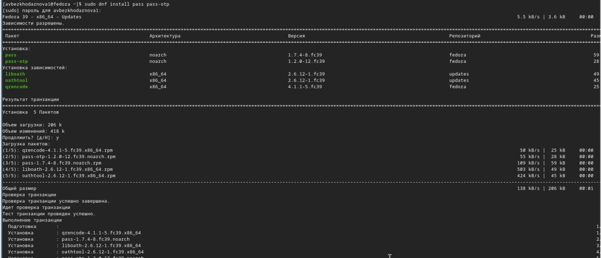
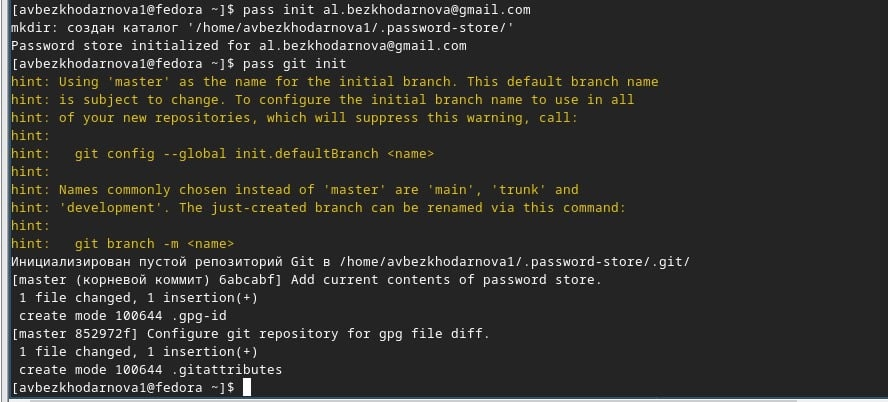
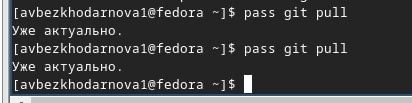
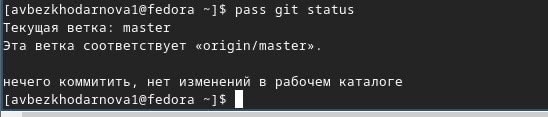
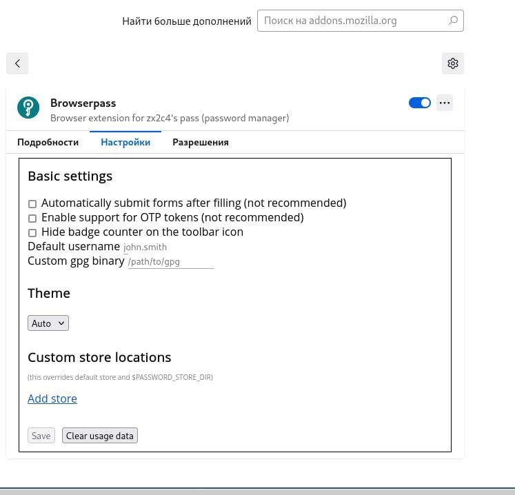
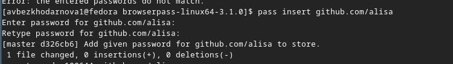
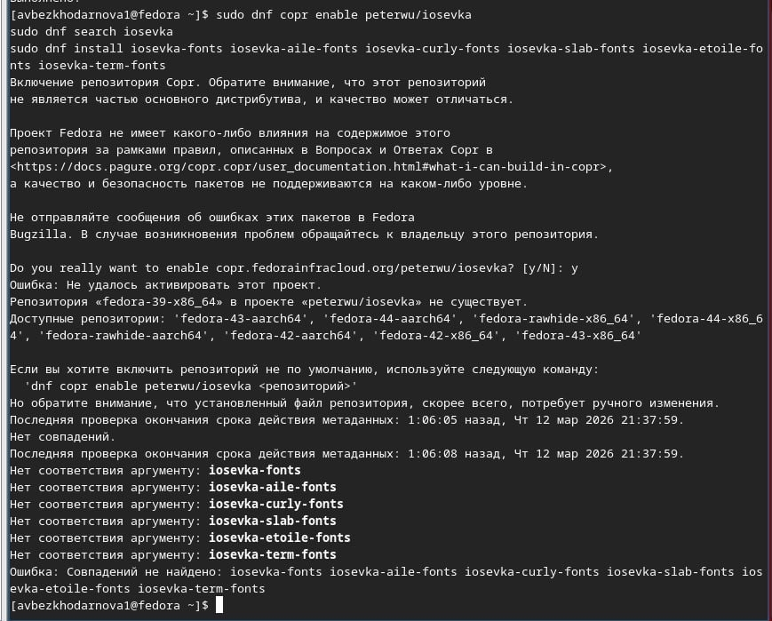

---
## Front matter
lang: ru-RU
title: Лабораторная работа №5
subtitle: Архитектура компьютеров
author:
  - Безходарнова А.В.
institute:
  - Российский университет дружбы народов, Москва, Россия
date: 14  марта 2026

## i18n babel
babel-lang: russian
babel-otherlangs: english

## Fonts
mainfont: Liberation Serif
sansfont: Liberation Sans
monofont: Liberation Mono

## Formatting pdf
toc: false
toc-title: Содержание
slide_level: 0
aspectratio: 169
section-titles: true
theme: metropolis
header-includes:
  - \metroset{progressbar=frametitle,sectionpage=progressbar,numbering=fraction}
---

# Информация

## Докладчик

:::::::::::::: {.columns align=center}
::: {.column width="70%"}

  * Безходарнова Алиса Викторовна
  * Студентка НКАбд-01-25
  * Алiса
  * Российский университет дружбы народов
  * [1032253545@rudn.ru](mailto1032253545@rudn.ru)

:::
::: {.column width="30%"}

:::
::::::::::::::

# Цель работы

Освоить применение систем управления паролями и конфигурационными файлами для обеспечения безопасности и синхронизации данных в операционный системе.

# Задание

Настроить менеджер паролей pass с шифрованием GPG и его сихронизацию через Git с удаленными репозиторием
Интегрировать pass с браузером через расширение browserpass для автоматического заполнения форм

# Актуальность темы.

Современные информационные системы требуют надёжных инструментов для хранения паролей и управления конфигурациями, что делает изучение pass, GPG и chezmoi востребованным для обеспечения безопасности и портативности рабочего окружения.

# Объект и предмет исследования.

Объект: системы управления паролями и конфигурационными файлами в Linux.

Предмет: функциональные возможности и практическое применение pass, GPG, browserpass и chezmoi.

# Научная новизна.

Работа систематизирует подходы к использованию современных open-source инструментов для безопасного хранения учётных данных и автоматизации развёртывания конфигураций, что может быть использовано в учебных курсах по операционным системам.

# Практическая значимость работы.

Полученные навыки позволяют эффективно организовывать безопасное хранение паролей, синхронизировать их между устройствами и управлять конфигурационными файлами, что упрощает администрирование и повышает защищённость данных.

# Теоретическое введение

Современные операционные системы предоставляют широкие возможности для автоматизации и повышения безопасности при работе с учётными данными и конфигурационными файлами. Менеджер паролей pass использует шифрование GPG для безопасного хранения паролей и позволяет синхронизировать их через Git, обеспечивая доступность на разных устройствах. Инструмент chezmoi предназначен для управления dot-файлами (конфигурациями), позволяя централизованно хранить и восстанавливать настройки рабочего окружения, что особенно полезно при работе на нескольких машинах.

# Выполнение лабораторной работы

Устанавливаю менеджер паролей pass. (рис. -@fig:001).

{#fig:001 width=70%}

---

И (рис. -@fig:002).

{#fig:002 width=70%}

---

Инициализирую хранилище (Рис -@fig:003).

{#fig:003 width=70%}

---

Синхронизирую сеть (Рис -@fig:004)

{#fig:004 width=70%}

---

Выполняю команды (Рис -@fig:005)

{#fig:005 width=70%}

---

Проверяю статус синхронизации (Рис -@fig:006)

{#fig:006 width=70%}

---

Настариваю интерфейс с броузером и проверяю (Рис -@fig:007)

){#fig:007 width=70}

---

Добавляю новый пароль (Рис -@fig:008)

{#fig:008 width=70%}

---

Отображаю пароль (Рис -@fig:009)

{#fig:009 width=70%}

---

Генерирую новый пароль (Рис -@fig:010)

{#fig:010 width=70%}

---

Устанавливаю дополнительное ПО (Рис -@fig:011)

{#fig:011 width=70%}

---

Устанавливаю шрифты (Рис -@fig:012)

{#fig:012 width=70%}

---

Устанавилваю бинарный файл (Рис -@fig:013)

{#fig:013 width=70%}

---

Создаю свой репозиторий на основе шаблона (Рис -@fig:014)

{#fig:014 width=70%}

---

Подключаю репозиторий к своей машине (Рис -@fig:015)

{fig:015 width=70%}

#Вывод

В ходе выполнения лабораторной работы я освоила принципы безопасного хранения паролей с помощью pass и GPG, настроила интеграцию с браузером через browserpass

# Список литературы{.unnumbered}
