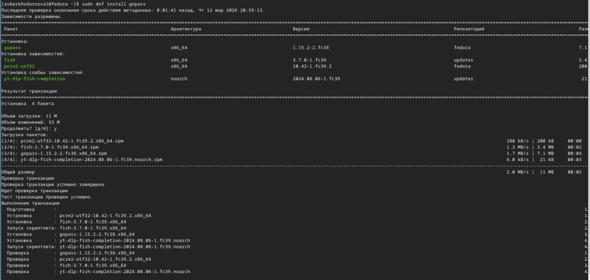
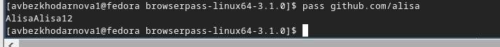
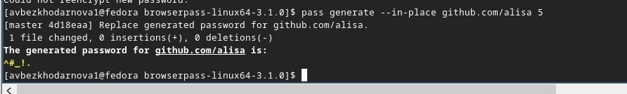
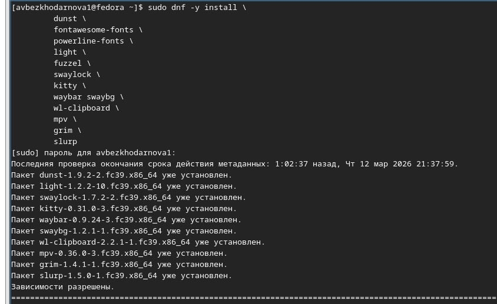
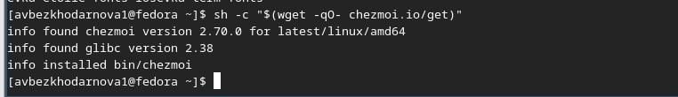
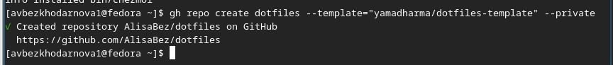
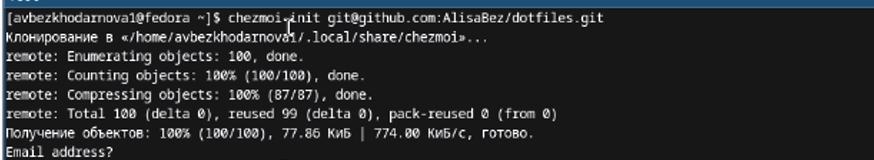

---
## Front matter
title: "Лабораторная работа №5"
subtitle: "дисциплина: Архитектура компьютера"
author: "Безходарнова Алиса Викторовна"

## Generic options
lang: ru-RU
toc-title: "Содержание"

## Bibliography
bibliography: bib/cite.bib
csl: pandoc/csl/gost-r-7-0-5-2008-numeric.csl

## Pdf output format
toc: true # Table of contents
toc-depth: 2
lof: true # List of figures
lot: true # List of tables
fontsize: 12pt
linestretch: 1.5
papersize: a4
documentclass: scrreprt
## I18n polyglossia
polyglossia-lang:
  name: russian
  options:
  - spelling=modern
  - babelshorthands=true
polyglossia-otherlangs:
  name: english
## I18n babel
babel-lang: russian
babel-otherlangs: english
## Fonts
mainfont: IBM Plex Serif
romanfont: IBM Plex Serif
sansfont: IBM Plex Sans
monofont: IBM Plex Mono
mathfont: STIX Two Math
mainfontoptions: Ligatures=Common,Ligatures=TeX,Scale=0.94
romanfontoptions: Ligatures=Common,Ligatures=TeX,Scale=0.94
sansfontoptions: Ligatures=Common,Ligatures=TeX,Scale=MatchLowercase,Scale=0.94
monofontoptions: Scale=MatchLowercase,Scale=0.94,FakeStretch=0.9
mathfontoptions:
## Biblatex
biblatex: true
biblio-style: "gost-numeric"
biblatexoptions:
  - parentracker=true
  - backend=biber
  - hyperref=auto
  - language=auto
  - autolang=other*
  - citestyle=gost-numeric
## Pandoc-crossref LaTeX customization
figureTitle: "Рис."
tableTitle: "Таблица"
listingTitle: "Листинг"
lofTitle: "Список иллюстраций"
lotTitle: "Список таблиц"
lolTitle: "Листинги"
## Misc options
indent: true
header-includes:
  - \usepackage{indentfirst}
  - \usepackage{float} # keep figures where there are in the text
  - \floatplacement{figure}{H} # keep figures where there are in the text
---
# Цель работы

Освоить применение систем управления паролями и конфигурационными файлами для обеспечения безопасности и синхронизации данных в операционный системе.

# Задание

Настроить менеджер паролей pass с шифрованием GPG и его сихронизацию через Git с удаленными репозиторием
Интегрировать pass с браузером через расширение browserpass для автоматического заполнения форм

# Теоретическое введение

Современные операционные системы предоставляют широкие возможности для автоматизации и повышения безопасности при работе с учётными данными и конфигурационными файлами. Менеджер паролей pass использует шифрование GPG для безопасного хранения паролей и позволяет синхронизировать их через Git, обеспечивая доступность на разных устройствах. Инструмент chezmoi предназначен для управления dot-файлами (конфигурациями), позволяя централизованно хранить и восстанавливать настройки рабочего окружения, что особенно полезно при работе на нескольких машинах.

# Выполнение лабораторной работы

Устанавливаю менеджер паролей pass. (рис. -@fig:001).

{#fig:001 width=70%}

И (рис. -@fig:002).

{#fig:002 width=70%}

Инициализирую хранилище (Рис -@fig:003).

{#fig:003 width=70%}

Синхронизирую сеть (Рис -@fig:004)

{#fig:004 width=70%}

Выполняю команда (Рис -@fig:005)

{#fig:005 width=70%}

Проверяю статус синхронизации (Рис -@fig:006)

{#fig:006 width=70%}

Настариваю интерфейс с броузером и проверяю (Рис -@fig:007)

){#fig:007 width=70}

Добавляю новый пароль (Рис -@fig:008)

{#fig:008 width=70%}

Отображаю пароль (Рис -@fig:009)

{#fig:009 width=70%}

Генерирую новый пароль (Рис -@fig:010)

{#fig:010 width=70%}

Устанавливаю дополнительное ПО (Рис -@fig:011)

{#fig:011 width=70%}

Устанавливаю шрифты (Рис -@fig:012)

{#fig:012 width=70%}

Устанавилваю бинарный файл (Рис -@fig:013)

{#fig:013 width=70%}

Создаю свой репозиторий на основе шаблона (Рис -@fig:014)

{#fig:014 width=70%}

Подключаю репозиторий к своей машине (Рис -@fig:015)

{fig:015 width=70%}

# Вывод

В ходе выполнения лабораторной работы я освоила принципы безопасного хранения паролей с помощью pass и GPG, настроила интеграцию с браузером через browserpass

# Список литературы{.unnumbered}
