---
## Front matter
lang: ru-RU
title: Лабораторная работа №6
subtitle: Архитектура компьютеров
author:
  - Безходарнова А.В.
institute:
  - Российский университет дружбы народов, Москва, Россия
date: 14  марта 2026

## i18n babel
babel-lang: russian
babel-otherlangs: english

## Fonts
mainfont: Liberation Serif
sansfont: Liberation Sans
monofont: Liberation Mono

## Formatting pdf
toc: false
toc-title: Содержание
slide_level: 0
aspectratio: 169
section-titles: true
theme: metropolis
header-includes:
  - \metroset{progressbar=frametitle,sectionpage=progressbar,numbering=fraction}
---

# Информация

## Докладчик

:::::::::::::: {.columns align=center}
::: {.column width="70%"}

  * Безходарнова Алиса Викторовна
  * Студентка НКАбд-01-25
  * Алiса
  * Российский университет дружбы народов
  * [1032253545@rudn.ru](mailto1032253545@rudn.ru)

:::
::: {.column width="30%"}

:::
::::::::::::::

# Цель работы

Приобретение практических навыков взаимодействия пользователя с системой посредством командной строки.

# Задание

Выполнить лабораторную работу по указаниям.

# Теоретическое введение

Приобретение практических навыков взаимодействия пользователя с системой по-
средством командной строки.

# Выполнение лабораторной работы

Определяю имя домашнего каталога. (рис. -@fig:001).

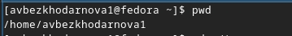{#fig:001 width=70%}

---

Перехожу в каталог tmp (рис. -@fig:002).

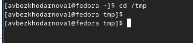{#fig:002 width=70%}

---

Иcпользую команду ls с разными опциями (Рис -@fig:003).

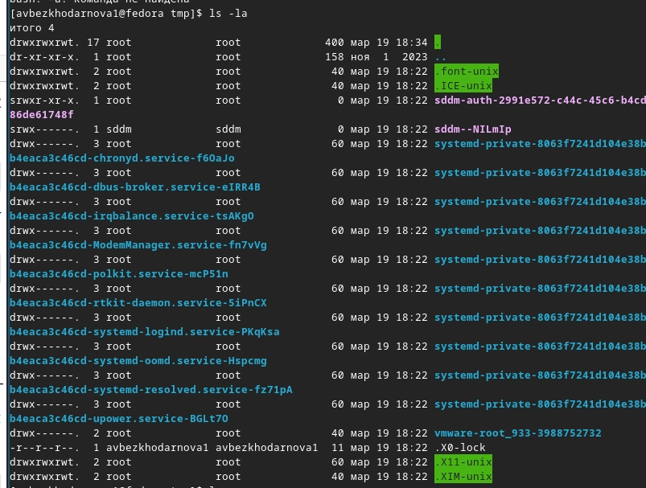{#fig:003 width=70%}

---

И (Рис -@fig:004)
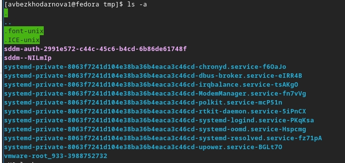{#fig:004 width=70%}

---

И (Рис -@fig:005)

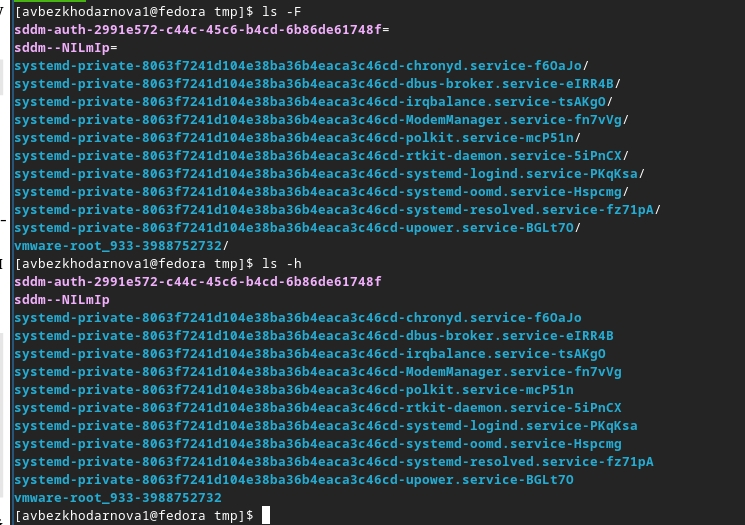{#fig:005 width=70%}

---

Проверяю есть ли подкатолог и убеждаюсь, что он есть (Рис -@fig:006)

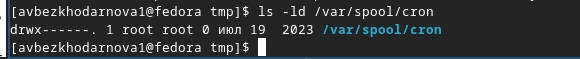{#fig:006 width=70%}

---

ВЫвожу на экран содержимое домашнего каталога (Рис -@fig:007)

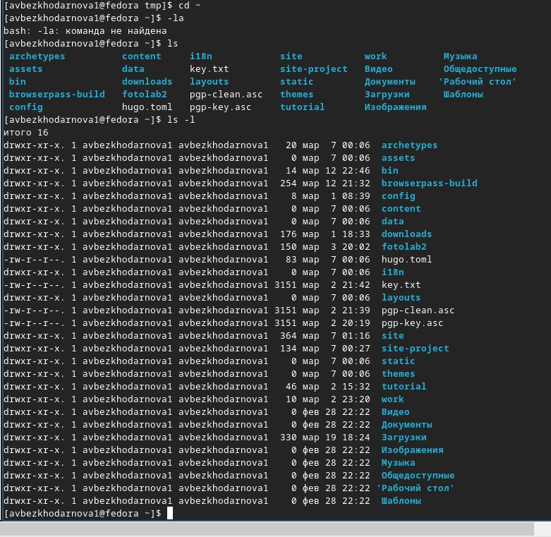){#fig:007 width=70}

---

Создание каталога newdir и morefun (Рис -@fig:008)

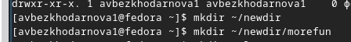{#fig:008 width=70%}

---

Создааю три новых каталога и удаляю их (Рис -@fig:009)

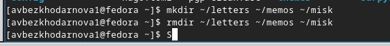{#fig:009 width=70%}

---

Пробую удалить каталог командой rm, потом удаляю каталог правильной командой и убеждаюсь, что он удален (Рис -@fig:010)

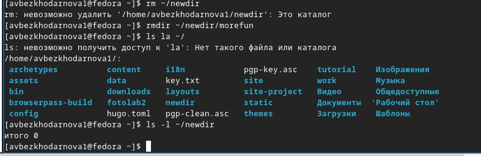{#fig:010 width=70%}

---

Определяю опцию (Рис -@fig:011)

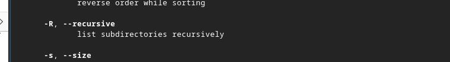{#fig:011 width=70%}

---

Использую команду man (Рис -@fig:012)

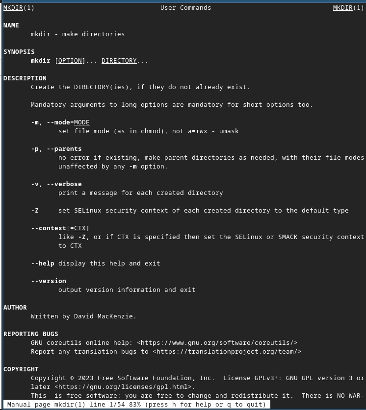{#fig:012 width=70%}

---

И (Рис -@fig:013)

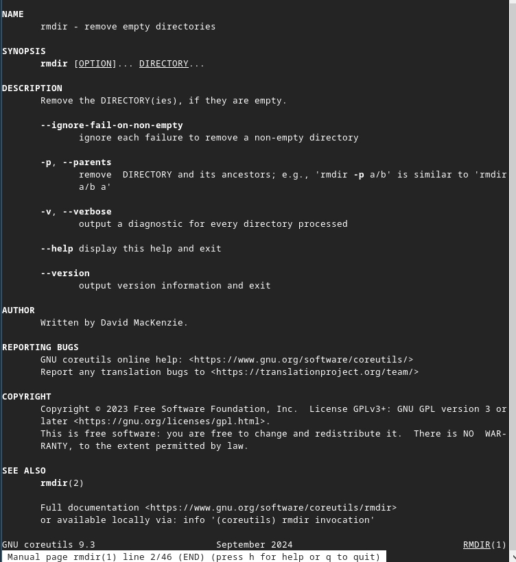{#fig:013 width=70%}

---

Просматриваю историю (Рис -@fig:014)

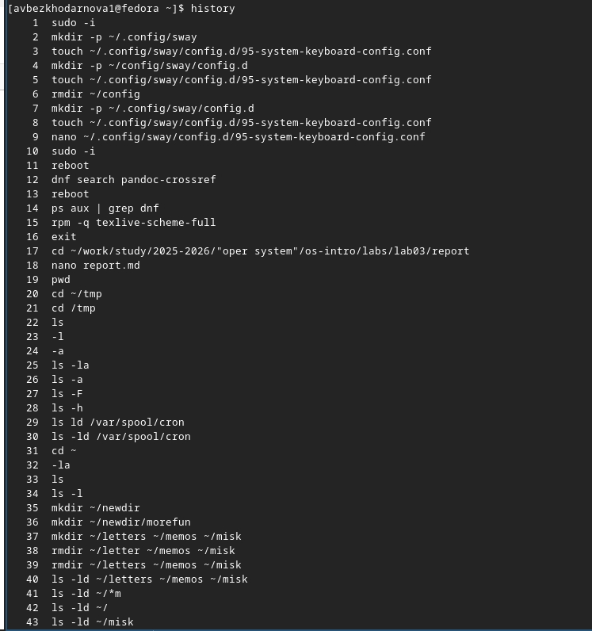{#fig:014 width=70%}

---

Меняю команды (Рис -@fig:015)

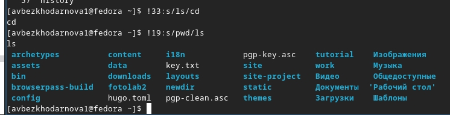{fig:015 width=70%}

# Вывод

В ходе данной работы я  Приобрела практические навыки взаимодействия пользователя с системой посредством командной строки

# Контрольные вопросы

1. Командная строка — это интерфейс взаимодействия пользователя с операционной системой, где команды вводятся в текстовом виде. В Linux взаимодействие осуществляется через командные интерпретаторы (shell), такие >

2. Команда pwd (print working directory) выводит абсолютный путь текущего каталога. Пример: pwd → /home/username

3. Команда ls -F отображает имена файлов с символами, указывающими тип: / для каталогов, * для исполняемых, @ для ссылок. Пример: ls -F

---

4.Для отображения скрытых файлов (начинающихся с точки) используется опция -a команды ls. Пример: ls -a или ls -la

5. Файлы удаляются командой rm, пустые каталоги — rmdir. Можно одной командой rm -r для рекурсивного удаления каталога с содержимым. Пример: rm file.txt, rmdir dir, rm -r dir

6. Команда history выводит список ранее выполненных команд с номерами. Пример: history

7. Используется конструкция !<номер>:s/что_меняем/на_что_меняем. Пример: !25:s/l/la/ заменит в команде №25 "l" на "la".

---

8. Несколько команд разделяются символом ;. Пример: cd /tmp; ls -l; pwd

9. Экранирование — это способ использования специальных символов как обычных с помощью обратного слеша \. Пример: echo \$HOME выведет $HOME, а не значение переменной.

10. Опция -l выводит подробную информацию: тип файла, права доступа, число ссылок, владельца, размер, дату последнего изменения и имя файла.

---

11. Относительный путь указывает положение файла относительно текущего каталога, абсолютный — от корня /. Пример: cd .. (относительный), cd /home/user (абсолютный).

12. Используется команда man (manual). Пример: man ls выведет руководство по команде ls.

13. Клавиша Tab служит для автоматического дополнения имён команд, файлов и каталогов.

# Список литературы{.unnumbered}
