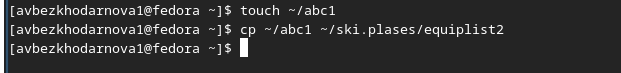
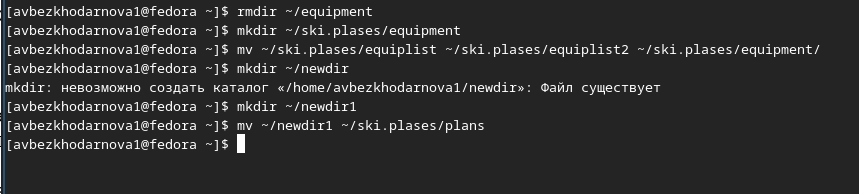
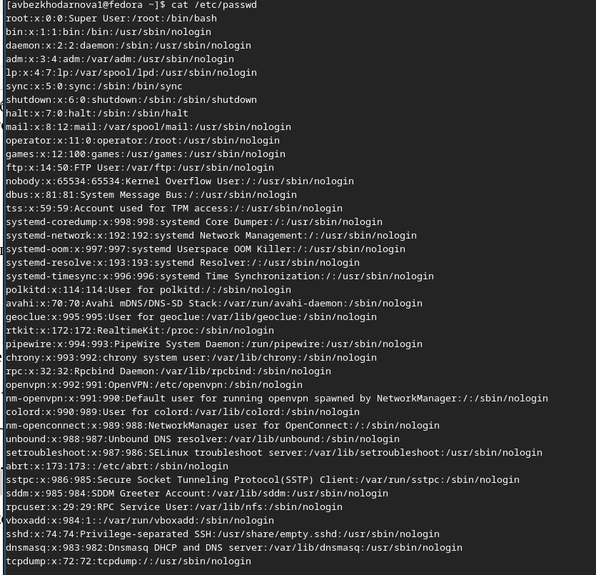
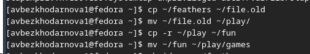
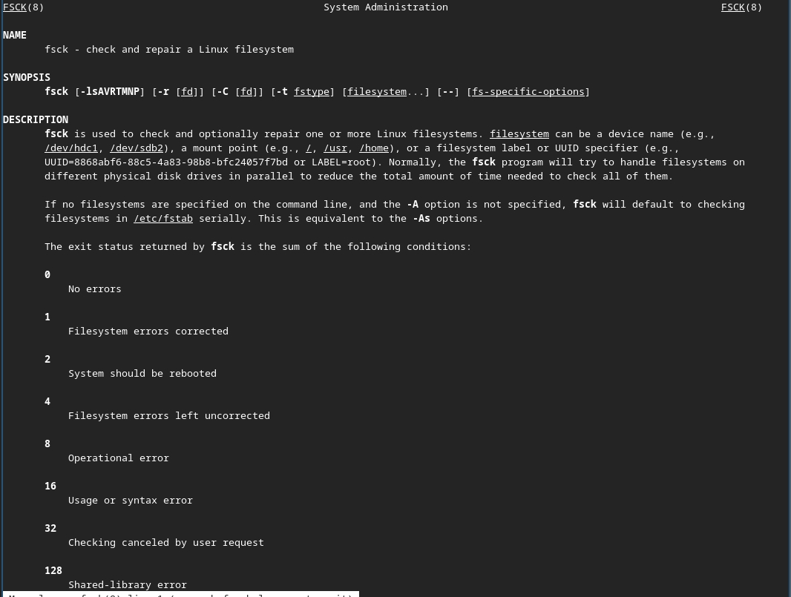
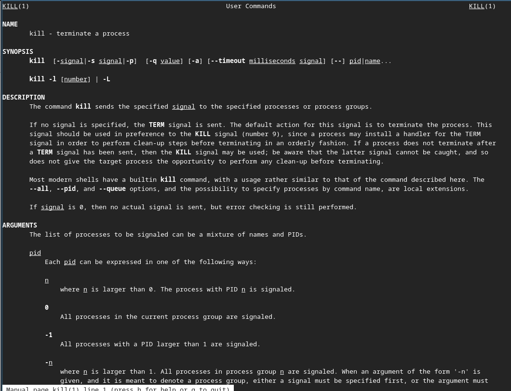
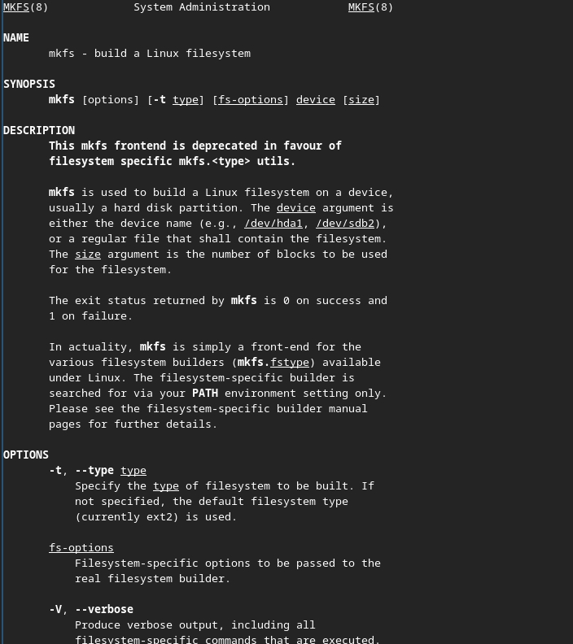

---
## Front matter
lang: ru-RU
title: Лабораторная работа №7
subtitle: Архитектура компьютеров
author:
  - Безходарнова А.В.
institute:
  - Российский университет дружбы народов, Москва, Россия
date: 28  марта 2026

## i18n babel
babel-lang: russian
babel-otherlangs: english

## Fonts
mainfont: Liberation Serif
sansfont: Liberation Sans
monofont: Liberation Mono

## Formatting pdf
toc: false
toc-title: Содержание
slide_level: 0
aspectratio: 169
section-titles: true
theme: metropolis
header-includes:
  - \metroset{progressbar=frametitle,sectionpage=progressbar,numbering=fraction}
---

# Информация

## Докладчик

:::::::::::::: {.columns align=center}
::: {.column width="70%"}

  * Безходарнова Алиса Викторовна
  * Студентка НКАбд-01-25
  * Алiса
  * Российский университет дружбы народов
  * [1032253545@rudn.ru](mailto1032253545@rudn.ru)

:::
::: {.column width="30%"}

:::
::::::::::::::

# Цель работы

Ознакомление с файловой системой Linux, её структурой, именами и содержанием каталогов. Приобретение прак>

# Задание

Выполнить лабораторную работу по указаниям.

# Теоретическое введение

Файловая система в Linux состоит из фалов и каталогов. Каждому физическому носи- телю соответствует своя файловая система. Существует несколько типов файловых систем. Перечислим наиболее часто встречаю- щиеся типы: – ext2fs (second extended filesystem); – ext2fs (third extended file system); – ext4 (fourth extended file system); – ReiserFS; – xfs; – fat (file allocation table); – ntfs (new technology file system). Для просмотра используемых в операционной системе файловых систем можно воспользоваться командой mount без параметров.

# Выполнение лабораторной работы

Сначала копирую файл, затем создаю новый каталог, в который перемещаю скопированный файл. (рис. -@fig:001>

{#fig:001 width=70%}

---

Cоздаю новый файл копирую туда файл и переименовываю его (рис. -@fig:002).

{#fig:002 width=70%}

---

Cоздаю новый каталог и перемещаю его и перименовываю (Рис -@fig:003).

{#fig:003 width=70%}

---

Определяю опции команды chmod (Рис -@fig:004)

{#fig:004 width=70%}

---

Промастриваю содержимое файла password (Рис -@fig:005)

{#fig:005 width=70%}

---

Копирую и перемещаю файлы (Рис -@fig:006)

{#fig:006 width=70%}

---

Лишаю файлов права на чтение, и смотрю, что получается. При лишение прав, система не дает к ним доступа  (Рис -@fig:007)

){#fig:007 width=70}

---

Командой man читаю команды (Рис -@fig:008)

{#fig:008 width=70%}

---

И (Рис -@fig:009)

{#fig:009 width=70%}

---

И (Рис -@fig:010)

{#fig:010 width=70%}

# Вывод

В ходе данной лабораторной работы я ознакомилась с файловой системой Linux, ее структурой именами и содержанием каталогов.

# Контрольные вопросы

1. Дайте характеристику каждой файловой системе, существующей на жёстком диске компьютера, на котором вы выполняли лабораторн>
В Fedora Sway на виртуальной машине файловая система жёсткого диска — ext4 (основная), также может быть swap (раздел подкачки>

---

2. Приведите общую структуру файловой системы и дайте характеристику каждой директории первого уровня этой структуры.
/ — корень.
/bin — основные команды.
/boot — загрузчик и ядро.
/dev — файлы устройств.
/etc — конфигурации.
/home — домашние папки пользователей.
/lib — библиотеки.
/media, /mnt — точки монтирования.
/opt — дополнительное ПО.
/proc, /sys — виртуальные файловые системы.
/root — домашняя папка root.
/sbin — системные команды.
/tmp — временные файлы.
/usr — пользовательские программы.
/var — переменные данные (логи, очереди).

---

3. Какая операция должна быть выполнена, чтобы содержимое некоторой файловой системы было доступно операционной системе?
Операция монтирования (команда mount).

4. Назовите основные причины нарушения целостности файловой системы. Как устранить повреждения файловой системы?
Причины: отключение питания, сбой ПО, ошибки диска. Устранение: fsck.

5. Как создаётся файловая система?
С помощью команды mkfs -t тип /dev/устройство.

---

6. Дайте характеристику командам для просмотра текстовых файлов.
cat — выводит весь файл, less — постраничный просмотр, head/tail — вывод начала или конца файла.

7. Приведите основные возможности команды cp в Linux.
Копирование файлов и каталогов (с опцией -r), запрос подтверждения перезаписи (-i).

8. Приведите основные возможности команды mv в Linux.
Перемещение и переименование файлов и каталогов.

---

9. Что такое права доступа? Как они могут быть изменены?
Права доступа — это правила чтения, записи и выполнения для владельца, группы и остальных. Изменяются командой chmod.

# Список литературы{.unnumbered}
