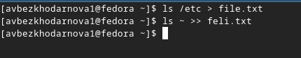
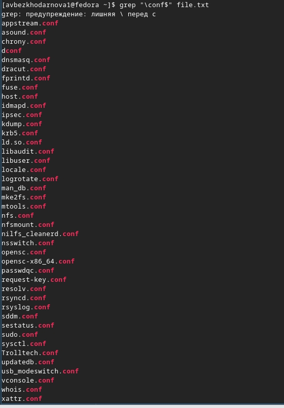
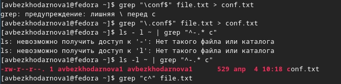
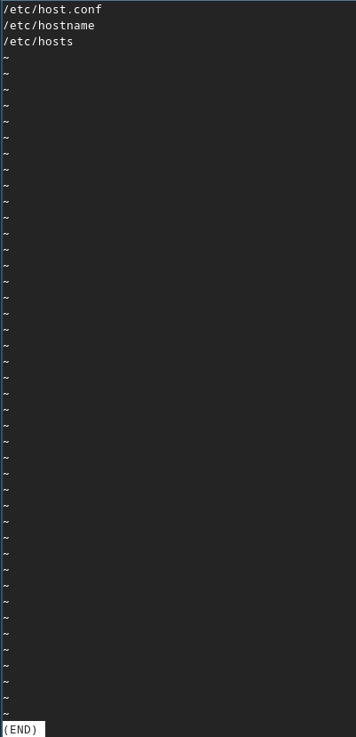
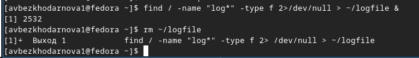
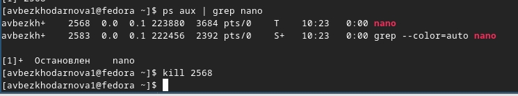
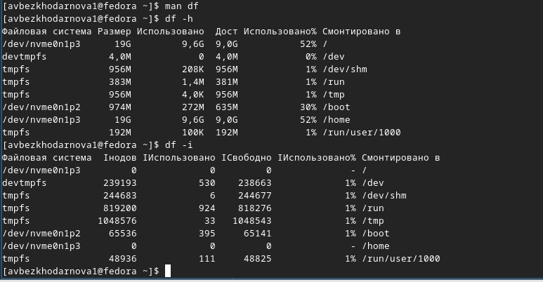
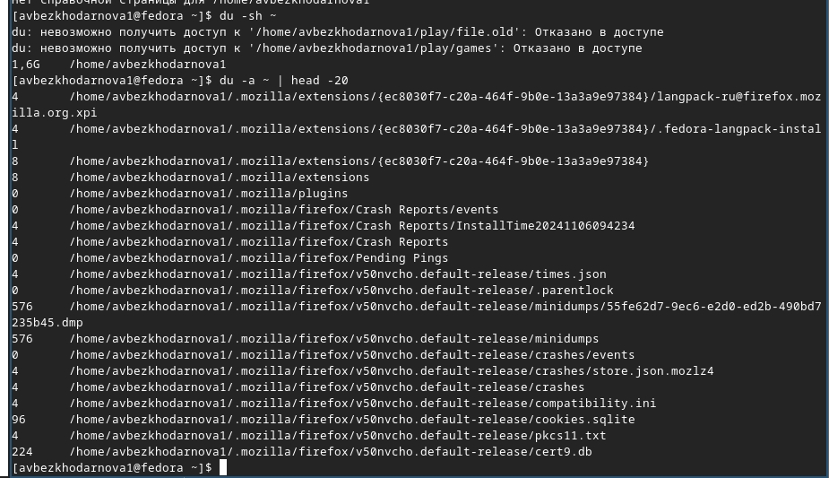
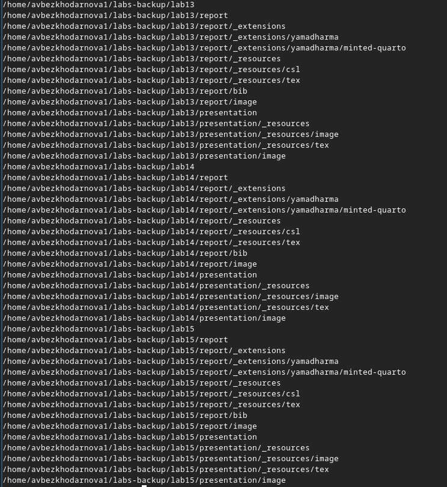

---
## Front matter
lang: ru-RU
title: Лабораторная работа №8
subtitle: Архитектура компьютеров
author:
  - Безходарнова А.В.
institute:
  - Российский университет дружбы народов, Москва, Россия
date: 28  марта 2026

## i18n babel
babel-lang: russian
babel-otherlangs: english

## Fonts
mainfont: Liberation Serif
sansfont: Liberation Sans
monofont: Liberation Mono

## Formatting pdf
toc: false
toc-title: Содержание
slide_level: 0
aspectratio: 169
section-titles: true
theme: metropolis
header-includes:
  - \metroset{progressbar=frametitle,sectionpage=progressbar,numbering=fraction}
---

# Информация

## Докладчик

:::::::::::::: {.columns align=center}
::: {.column width="70%"}

  * Безходарнова Алиса Викторовна
  * Студентка НКАбд-01-25
  * Алiса
  * Российский университет дружбы народов
  * [1032253545@rudn.ru](mailto1032253545@rudn.ru)

:::
::: {.column width="30%"}

:::
::::::::::::::

# Цель работы

Ознакомление с инструментами поиска файлов и фильтрации текстовых данных. Приобретение практических навыков: по управлению процессами (и заданиями), по проверке использования диска и обслуживанию файловых систем

# Задание

Выполнить лабораторную работу по указаниям.

# Теоретическое введение

Большинство используемых в консоли команд и программ записывают результаты своей работы в стандартный поток вывода stdout. Например, команда ls выводит в стандартный поток вывода (консоль) список файлов в текущей директории. Потоки вывода и ввода можно перенаправлять на другие файлы или устройства. Проще всего это делается с помощью символов >, >>, <, <<.

# Выполнение лабораторной работы

Сначала записываю в  файл file.txt названия файлов из каталога  etc. (рис. -@fig:001).

{#fig:001 width=70%}

---

Вывожу имена всех файлов с расширением .conf (рис. -@fig:002).

{#fig:002 width=70%}

---

Определяю файлы, которые начинаются с с (Рис -@fig:003).

{#fig:003 width=70%}

---

Вывожу имена файлов, которые начинаются с h (Рис -@fig:004)

{#fig:004 width=70%}

---

Запускаю в фоновом режиме, а потом удаляю файл logfile (Рис -@fig:005)

{#fig:005 width=70%}

---

Запускаю в фоновом режиме редактор nano. Определяю как завершить процесс и завершаю его (Рис -@fig:006)

{#fig:006 width=70%}

---

Выполняю команду df (Рис -@fig:007)

){#fig:007 width=70}

---

Выполняю команду du (Рис -@fig:008)

{#fig:008 width=70%}

---

Вывожу имена всех директорий (Рис -@fig:009)

{#fig:009 width=70%}

---

# Вывод

В ходе данной лабораторной работы я ознакомилась с инструментами поиска файлов и фильтрации текстовых данных. Также приобрела практические навыки.

# Контрольные вопросы

1. Какие потоки ввода вывода вы знаете?
Стандартный поток ввода (stdin), стандартный поток вывода (stdout), стандартный поток вывода ошибок (stderr).

2. Объясните разницу между операцией > и >>.
Операция > перезаписывает содержимое файла, а операция >> добавляет новые данные в конец файла, не удаляя существующие.

3. Что такое конвейер?
Конвейер — это механизм, позволяющий передавать вывод одной команды на ввод другой команде с помощью символа |.

---

4. Что такое процесс? Чем это понятие отличается от программы?
Процесс — это программа в момент выполнения, которая имеет свой идентификатор, память и окружение, а программа — это статичный набор инструкций, хранящийся на диске.

5. Что такое PID и GID?
PID — это идентификатор процесса, GID — это идентификатор группы процесса.

6. Что такое задачи и какая команда позволяет ими управлять?
Задачи — это процессы, запущенные из текущей оболочки; управляет ими команда jobs.

---

7. Найдите информацию об утилитах top и htop. Каковы их функции?
Top и htop — это интерактивные утилиты для просмотра запущенных процессов, загрузки процессора, памяти и других системных ресурсов в реальном времени.

8. Назовите и дайте характеристику команде поиска файлов. Приведите примеры использования этой команды.
Команда find используется для поиска файлов по различным критериям. Примеры: find ~ -name ".txt" — ищет все текстовые файлы в домашнем каталоге, find /etc -type f -name ".conf" — ищет все конфигурационные файлы в каталоге /etc.

9. Можно ли по контексту (содержанию) найти файл? Если да, то как?
Да, можно с помощью команды grep с опцией -r для рекурсивного поиска. Пример: grep -r "искомый текст" ~/

---

10. Как определить объем свободной памяти на жёстком диске?
Командой df -h

11. Как определить объем вашего домашнего каталога?
Командой du -sh ~

12. Как удалить зависший процесс?
Использовать команду kill -9 с указанием PID зависшего процесса.

# Список литературы{.unnumbered}
