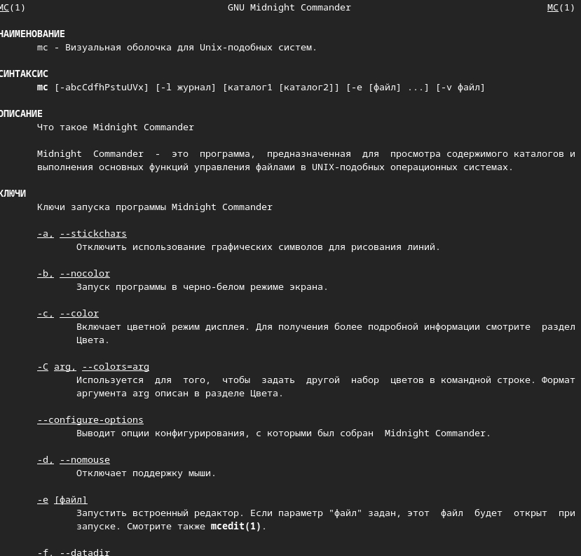
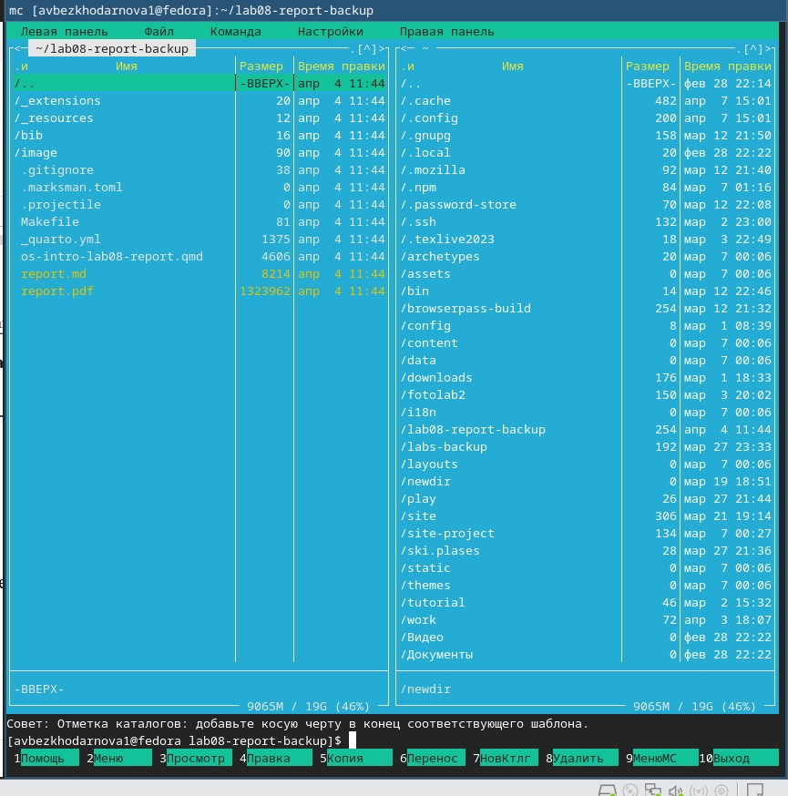
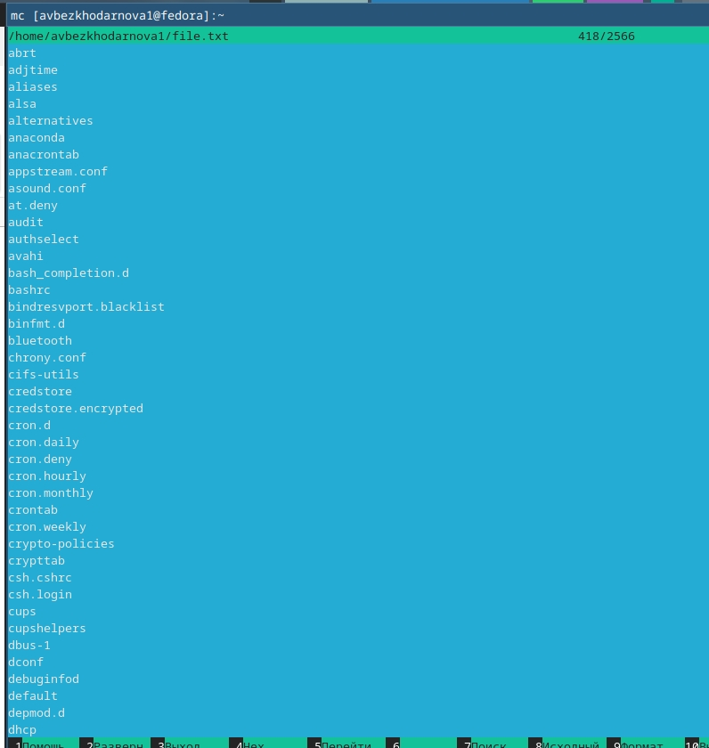
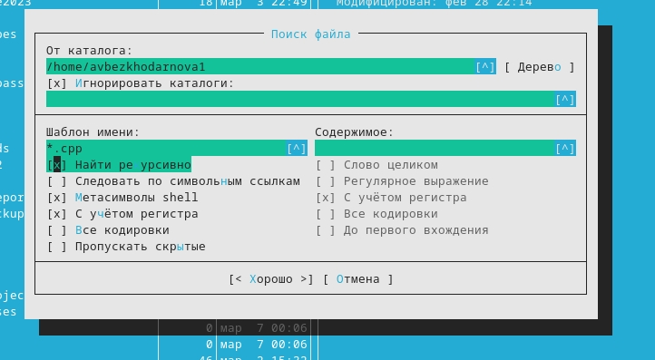
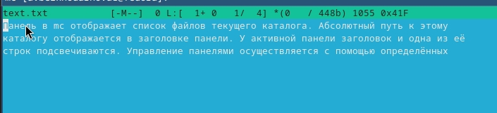
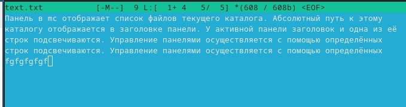
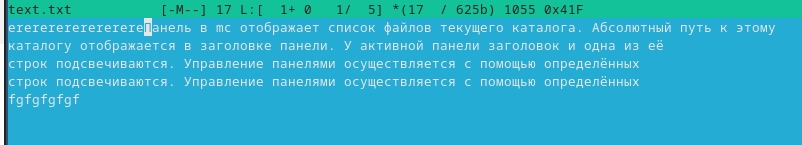

---
## Front matter
lang: ru-RU
title: Лабораторная работа №9
subtitle: Архитектура компьютеров
author:
  - Безходарнова А.В.
institute:
  - Российский университет дружбы народов, Москва, Россия
date: 11 апреля  2026

## i18n babel
babel-lang: russian
babel-otherlangs: english

## Fonts
mainfont: Liberation Serif
sansfont: Liberation Sans
monofont: Liberation Mono

## Formatting pdf
toc: false
toc-title: Содержание
slide_level: 0
aspectratio: 169
section-titles: true
theme: metropolis
header-includes:
  - \metroset{progressbar=frametitle,sectionpage=progressbar,numbering=fraction}
---

# Информация

## Докладчик

:::::::::::::: {.columns align=center}
::: {.column width="70%"}

  * Безходарнова Алиса Викторовна
  * Студентка НКАбд-01-25
  * Алiса
  * Российский университет дружбы народов
  * [1032253545@rudn.ru](mailto1032253545@rudn.ru)

:::
::: {.column width="30%"}

:::
::::::::::::::

# Цель работы

Освоение основных возможностей командной оболочки Midnight Commander. Приобретение навыков практической работы по просмотру каталогов и файлов; манипуляций с ними.

# Задание

Выполнить лабораторную работу по указаниям.

# Теоретическое введение

Командная оболочка — интерфейс взаимодействия пользователя с операционной системой и программным обеспечением посредством команд. Midnight Commander (или mc) — псевдографическая командная оболочка для UNIX/Linux систем. Для запуска mc необходимо в командной строке набрать mc и нажать Enter .Рабочее пространство mc имеет две панели, отображающие по умолчанию списки файлов двух каталогов 

# Выполнение лабораторной работы

Вызываю man mc чтобы изучить информацию. (рис. -@fig:001).

{#fig:001 width=70%}

---

Изучаю структуру и меню (рис. -@fig:002).

{#fig:002 width=70%}

---

Изучаю файл (Рис -@fig:003).

{#fig:003 width=70%}

---

Выполняю поиск файлов (Рис -@fig:004)

{#fig:004 width=70%}

---

Cоздаю текстовый файл и вставляю туда текст (Рис -@fig:005)

{#fig:005 width=70%}

---

Копирую строчку текста, удаляю ее, потом с помощью клавиш пишу в конце текста

{#fig:006 width=70%}

---

Вставляю текст в начало файла. (Рис -@fig:007)

){#fig:007 width=70}

# Вывод

В ходе данной лабораторной работы я освоила основные возможности командной облочки Midnight Commander. Приобрела навыки практической работы.

# Контрольные вопросы

1. Kакие режимы работы есть в mc. Охарактеризуйте их. Midnight Commander имеет два основных режима отображения панелей: режим Информация, показывающий данные о текущем файле и файловой системе, и режим Дерево, отображающее структуру каталогов.

2. Какие операции с файлами можно выполнить как с помощью команд shell, так и с помощью меню (комбинаций клавиш) mc? Приведите несколько примеров. Такие операции как копирование, перемещение и удаление файлов можно выполнить как стандартными командами shell (cp, mv, rm), так и в mc с помощью функциональных клавиш F5, F6 и F8 соответственно.

3. Опишите структура меню левой (или правой) панели mc, дайте характеристику командам. Меню левой и правой панели позволяет выбрать формат списка файлов (стандартный, расширенный, ускоренный), задать порядок сортировки, а также переключить режим отображения панели на Информация или Дерево.

---

4. Опишите структура меню Файл mc, дайте характеристику командам. Меню Файл содержит команды для работы с файлами: просмотр (F3), правка (F4), копирование (F5), перемещение (F6), удаление (F8), создание каталога (F7), а также изменение прав доступа (Ctrl-x c) и владельца (Ctrl-x o).

5. Опишите структура меню Команда mc, дайте характеристику командам. Меню Команда включает такие возможности как дерево каталогов, поиск файлов (Alt+?), сравнение каталогов (Ctrl-x d), перестановку панелей (Ctrl-u), а также редактирование файла меню и файла расширений пользователя.

6. Опишите структура меню Настройки mc, дайте характеристику командам. Меню Настройки позволяет сконфигурировать внешний вид mc (цвета, режим отображения), установить подтверждения для опасных операций, настроить виртуальные файловые системы и выполнить распознавание клавиш.

---

7. Назовите и дайте характеристику встроенным командам mc. Встроенные команды mc включают работу с виртуальными файловыми системами (архивами, FTP, SFTP), поддержку пользовательского меню (F2), список каталогов быстрого доступа (Ctrl+), а также выполнение операций в фоновом режиме.

8. Назовите и дайте характеристику командам встроенного редактора mc. Встроенный редактор mcedit поддерживает такие команды: удаление строки (Ctrl-y), отмена действия (Ctrl-u), поиск (F7), замена (F4), копирование выделенного фрагмента (F5), перемещение выделенного фрагмента (F6), удаление выделенного фрагмента (F8), сохранение (F2) и выход (F10).

9. Дайте характеристику средствам mc, которые позволяют создавать меню, определяемые
пользователем. Пользовательское меню создаётся через редактирование файла ~/.config/mc/menu, вызывается по клавише F2 и позволяет выполнять часто повторяемые команды.

---

10. Дайте характеристику средствам mc, которые позволяют выполнять действия, определяемые пользователем, над текущим файлом. Средства включают файл расширений, который ассоциирует типы файлов с определёнными действиями, а также возможность добавлять свои команды в пользовательское меню для обработки текущего файла.

# Список литературы{.unnumbered}
