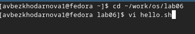
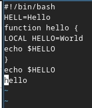
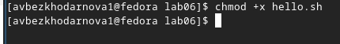
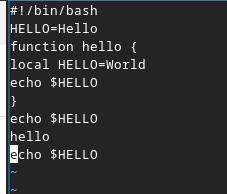
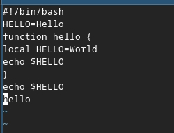

---
## Front matter
title: "Лабораторная работа №10"
subtitle: "дисциплина: Архитектура компьютера"
author: "Безходарнова Алиса Викторовна"

## Generic options
lang: ru-RU
toc-title: "Содержание"

## Bibliography
bibliography: bib/cite.bib
csl: pandoc/csl/gost-r-7-0-5-2008-numeric.csl

## Pdf output format
toc: true # Table of contents
toc-depth: 2
lof: true # List of figures
lot: true # List of tables
fontsize: 12pt
linestretch: 1.5
papersize: a4
documentclass: scrreprt
## I18n polyglossia
polyglossia-lang:
  name: russian
  options:
  - spelling=modern
  - babelshorthands=true
polyglossia-otherlangs:
  name: english
## I18n babel
babel-lang: russian
babel-otherlangs: english
## Fonts
mainfont: IBM Plex Serif
romanfont: IBM Plex Serif
sansfont: IBM Plex Sans
monofont: IBM Plex Mono
mathfont: STIX Two Math
mainfontoptions: Ligatures=Common,Ligatures=TeX,Scale=0.94
romanfontoptions: Ligatures=Common,Ligatures=TeX,Scale=0.94
sansfontoptions: Ligatures=Common,Ligatures=TeX,Scale=MatchLowercase,Scale=0.94
monofontoptions: Scale=MatchLowercase,Scale=0.94,FakeStretch=0.9
mathfontoptions:
## Biblatex
biblatex: true
biblio-style: "gost-numeric"
biblatexoptions:
  - parentracker=true
  - backend=biber
  - hyperref=auto
  - language=auto
  - autolang=other*
  - citestyle=gost-numeric
## Pandoc-crossref LaTeX customization
figureTitle: "Рис."
tableTitle: "Таблица"
listingTitle: "Листинг"
lofTitle: "Список иллюстраций"
lotTitle: "Список таблиц"
lolTitle: "Листинги"
## Misc options
indent: true
header-includes:
  - \usepackage{indentfirst}
  - \usepackage{float} # keep figures where there are in the text
  - \floatplacement{figure}{H} # keep figures where there are in the text
---
# Цель работы

Познакомиться с операционной системой Linux. Получить практические навыки работы с редактором vi, установленным по умолчанию практически во всех дистрибутивах.

# Задание

1. Ознакомиться с теоретическим материалом.
2. Ознакомиться с редактором vi.
3. Выполнить упражнения, используя команды vi.

# Теоретическое введение

В большинстве дистрибутивов Linux в качестве текстового редактора по умолчанию устанавливается интерактивный экранный редактор vi (Visual display editor). Редактор vi имеет три режима работы:
– командный режим — предназначен для ввода команд редактирования и навигации по
редактируемому файлу;
– режим вставки — предназначен для ввода содержания редактируемого файла;
– режим последней (или командной) строки — используется для записи изменений в файл и выхода из редактора.
Для вызова редактора vi необходимо указать команду vi и имя редактируемого файла:
vi <имя_файла>
При этом в случае отсутствия файла с указанным именем будет создан такой файл. Переход в командный режим осуществляется нажатием клавиши Esc . Для выхода из редактора vi необходимо перейти в режим последней строки: находясь в командном режиме, нажать Shift-; (по сути символ : — двоеточие), затем:
– набрать символы wq, если перед выходом из редактора требуется записать изменения
в файл;
– набрать символ q (или q!), если требуется выйти из редактора без сохранения.

# Выполнение лабораторной работы

Cоздаю новый каталог, перехожу в него и вызываю файл. (рис. -@fig:001).

{#fig:001 width=70%}

Ввожу текст в файл (рис. -@fig:002).

{#fig:002 width=70%}

Делаю файл исполянемым (Рис -@fig:003).

{#fig:003 width=70%}

Меняю текст по указаниям (Рис -@fig:004)

{#fig:004 width=70%}

Удаляю добавленную строку (Рис -@fig:005)

{#fig:005 width=70%}

С помощью клавиш возвращаю строчку и сохраняю файл

{#fig:006 width=70%}

# Вывод

В ходе данной лабораторной работы я освоила возможности работы с редактором vi и пПриобрела навыки практической работы.

# Контрольные вопросы

1. Дайте краткую характеристику режимам работы редактора vi.
Командный (ввод команд), ввода (набор текста), последней строки (команды с :), визуальный (выделение).

2. Как выйти из редактора, не сохраняя произведённые изменения?
В командном режиме :q!.

3. Назовите и дайте краткую характеристику командам позиционирования.
h/j/k/l — движение, w/b — по словам, 0/$ — начало/конец строки, gg/G — начало/конец файла.

4. Что для редактора vi является словом?
Последовательность букв, цифр и знака подчёркивания, ограниченная пробелами или знаками препинания.

5. Каким образом из любого места редактируемого файла перейти в начало (конец) файла?
gg — в начало, G — в конец.

6. Назовите и дайте краткую характеристику основным группам команд редактирования.
Удаление (dd, x), вставка (i, a), замена (r, s), копирование/вставка (yy, p), отмена (u), повтор (.).

7. Необходимо заполнить строку символами $. Каковы ваши действия?
cc (очистить строку и войти в режим ввода), затем набрать нужное количество $.

8. Как отменить некорректное действие, связанное с процессом редактирования?
u — отмена, Ctrl+r — возврат отменённого.

9. Назовите и дайте характеристику основным группам команд режима последней строки.
Сохранение (:w), выход (:q), поиск (/), замена (:s/old/new/), установка параметров (:set).

10. Как определить, не перемещая курсора, позицию, в которой заканчивается строка?
Команда $ перемещает курсор. Без перемещения — визуально по номеру строки или :set number.

11. Выполните анализ опций редактора vi (сколько их, как узнать их назначение и т.д.).
Десятки. Узнать — :set all, назначение конкретной — :help option.

12. Как определить режим работы редактора vi?
По реакции клавиш: ввод текста — режим ввода, команды — командный, строка с : — режим последней строки.

13. Постройте граф взаимосвязи режимов работы редактора vi.
Командный → режим ввода через i/a/o, обратно через Esc.
Командный → режим последней строки через :, обратно через Enter.
Командный → визуальный через v/V, обратно через Esc.

# Список литературы{.unnumbered}
