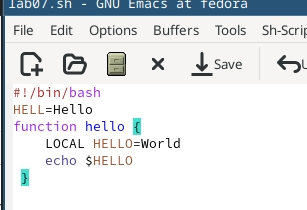
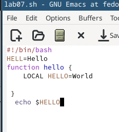
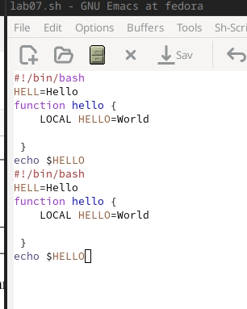
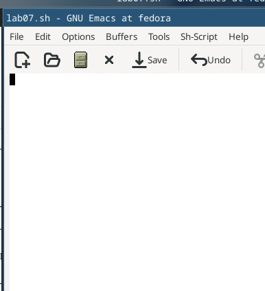
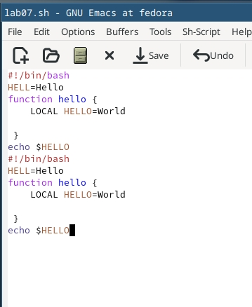
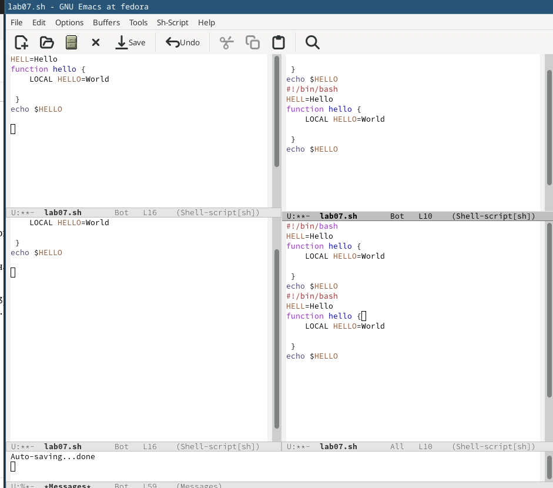
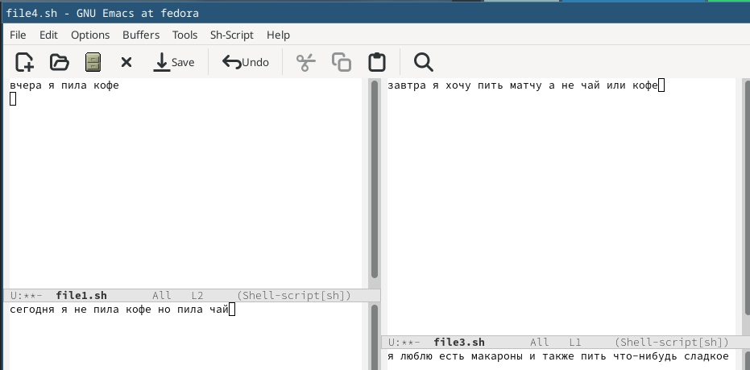
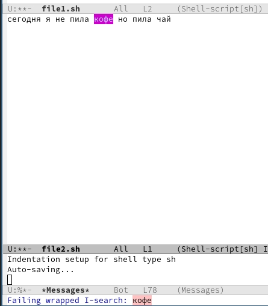

---
## Front matter
lang: ru-RU
title: Лабораторная работа №11
subtitle: Архитектура компьютеров
author:
  - Безходарнова А.В.
institute:
  - Российский университет дружбы народов, Москва, Россия
date: 25  апреля  2026

## i18n babel
babel-lang: russian
babel-otherlangs: english

## Fonts
mainfont: Liberation Serif
sansfont: Liberation Sans
monofont: Liberation Mono

## Formatting pdf
toc: false
toc-title: Содержание
slide_level: 0
aspectratio: 169
section-titles: true
theme: metropolis
header-includes:
  - \metroset{progressbar=frametitle,sectionpage=progressbar,numbering=fraction}
---

# Информация

## Докладчик

:::::::::::::: {.columns align=center}
::: {.column width="70%"}

  * Безходарнова Алиса Викторовна
  * Студентка НКАбд-01-25
  * Алiса
  * Российский университет дружбы народов
  * [1032253545@rudn.ru](mailto1032253545@rudn.ru)

:::
::: {.column width="30%"}

:::
::::::::::::::

# Цель работы

Познакомиться с операционной системой Linux. Получить практические навыки работы с редактором Emacs

# Задание

1. Ознакомиться с теоретическим материалом.
2. Ознакомиться с редактором emacs.
3. Выполнить упражнения.
4. Ответить на контрольные вопросы.

# Теоретическое введение

Буфер — объект, представляющий какой-либо текст. Буфер может содержать что угодно, например, результаты компиляции программы или встроенные подсказки. Практически всё взаимодействие с пользователем, в том числе интерактивное, происходит посредством буферов. Фрейм соответствует окну в обычном понимании этого слова. Каждый
фрейм содержит область вывода и одно или несколько окон Emacs. Окно — прямоугольная область фрейма, отображающая один из буферов.
Каждое окно имеет свою строку состояния, в которой выводится следующая информация: название буфера, его основной режим, изменялся ли текст буфера и как далеко вниз
по буферу расположен курсор. Каждый буфер находится только в одном из возможных основных режимов. Существующие основные режимы включают режим Fundamental (наименее специализированный), режим Text, режим Lisp, режим С, режим Texinfo и другие. Под второстепенными режимами понимается список режимов, которые включены в данный момент в буфере выбранного окна.

# Выполнение лабораторной работы

Открываю редактор, создаю файл и записываю туда текст.  (рис. -@fig:001).

{#fig:001 width=70%}

---

Вырезаю строчку и вставляю ее в конец файла (рис. -@fig:002).

{#fig:002 width=70%}

---

Выделяю облатсь текста и также вставляю ее в конец (Рис -@fig:003).

{#fig:003 width=70%}

---

Удаляю всю облсть с помощью клавиш (Рис -@fig:004)

{#fig:004 width=70%}

---

Возвращаю все обратно (Рис -@fig:005)

{#fig:005 width=70%}

---

Делю фрейм на 4 части.

{#fig:006 width=70%}

---

В каждом новом окне пишу текст

{#fig:007 width=70%}

---

Выполняю поиск

{#fig:008 width=70%}

# Вывод

В ходе данной лабораторной работы я познакомилась с операционной системой Linux и приобрела практические навыки работы с редактором Emacs.

# Контрольные вопросы

1. Кратко охарактеризуйте редактор emacs. - Emacs — мощный расширяемый текстовый редактор на языке Elisp, поддерживающий буферы, окна, фреймы и множество режимов.

2. Какие особенности данного редактора могут сделать его сложным для освоения новичком? - Нестандартные комбинации клавиш (C-, M-), отсутствие привычных Ctrl+C/Ctrl+V, большое количество команд, непривычная терминология.

3. Своими словами опишите, что такое буфер и окно в терминологии emacs’а. - Буфер — это область памяти, содержащая текст (файл, справку, сообщение). Окно — прямоугольная область на экране, в которой отображается один из буферов.

---

4. Можно ли открыть больше 10 буферов в одном окне? - Да, можно. В одном окне одновременно виден только один буфер, но переключаться между буферами можно в любом количестве.

5. Какие буферы создаются по умолчанию при запуске emacs? - scratch, Messages, GNU Emacs.

6. Какие клавиши вы нажмёте, чтобы ввести следующую комбинацию C-c | и C-c C-|? - C-c |: Ctrl+C, затем Shift+\. C-c C-|: Ctrl+C, затем Ctrl+Shift+\.

---

7. Как поделить текущее окно на две части? - C-x 2 (горизонтально) или C-x 3 (вертикально).

8. В каком файле хранятся настройки редактора emacs? - ~/.emacs или ~/.emacs.d/init.el.

9. Какую функцию выполняет клавиша <- (стрелка влево) и можно ли её переназначить? - Стрелка влево перемещает курсор на один символ влево. Да, можно переназначить через global-set-key или define-key.

---

10. Какой редактор вам показался удобнее в работе vi или emacs? Поясните почему. - Emacs удобнее, потому что он немодальный (не нужно переключать режимы), имеет удобную работу с буферами и окнами, встроенную справку и легко расширяется.

# Список литературы{.unnumbered}
