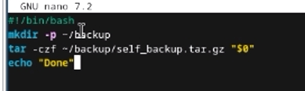
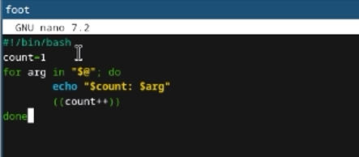
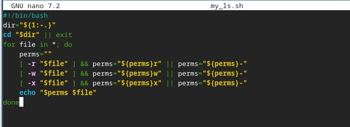
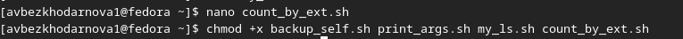
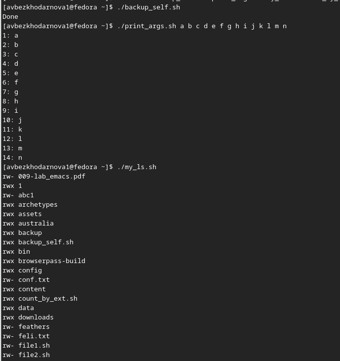
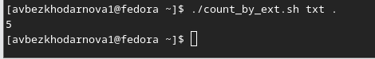

---
## Front matter
lang: ru-RU
title: Лабораторная работа №12
subtitle: Архитектура компьютеров
author:
  - Безходарнова А.В.
institute:
  - Российский университет дружбы народов, Москва, Россия
date: 25  апреля  2026

## i18n babel
babel-lang: russian
babel-otherlangs: english

## Fonts
mainfont: Liberation Serif
sansfont: Liberation Sans
monofont: Liberation Mono

## Formatting pdf
toc: false
toc-title: Содержание
slide_level: 0
aspectratio: 169
section-titles: true
theme: metropolis
header-includes:
  - \metroset{progressbar=frametitle,sectionpage=progressbar,numbering=fraction}
---

# Информация

## Докладчик

:::::::::::::: {.columns align=center}
::: {.column width="70%"}

  * Безходарнова Алиса Викторовна
  * Студентка НКАбд-01-25
  * Алiса
  * Российский университет дружбы народов
  * [1032253545@rudn.ru](mailto1032253545@rudn.ru)

:::
::: {.column width="30%"}

:::
::::::::::::::
# Цель работы

Изучить основы программирования в оболочке ОС UNIX/Linux. Научиться писать небольшие командные файлы.

# Задание

1. Написать скрипт, который при запуске будет делать резервную копию самого себя (то
есть файла, в котором содержится его исходный код) в другую директорию backup
в вашем домашнем каталоге. При этом файл должен архивироваться одним из ар-
хиваторов на выбор zip, bzip2 или tar. Способ использования команд архивации
необходимо узнать, изучив справку.
2. Написать пример командного файла, обрабатывающего любое произвольное число
аргументов командной строки, в том числе превышающее десять. Например, скрипт
может последовательно распечатывать значения всех переданных аргументов.
3. Написать командный файл — аналог команды ls (без использования самой этой ко-
манды и команды dir). Требуется, чтобы он выдавал информацию о нужном каталоге
и выводил информацию о возможностях доступа к файлам этого каталога.
4. Написать командный файл, который получает в качестве аргумента командной строки
формат файла (.txt, .doc, .jpg, .pdf и т.д.) и вычисляет количество таких файлов
в указанной директории. Путь к директории также передаётся в виде аргумента ко-
мандной строки.

# Теоретическое введение

Командный процессор (командная оболочка, интерпретатор команд shell) — это программа, позволяющая пользователю взаимодействовать с операционной системой компьютера. В операционных системах типа UNIX/Linux наиболее часто используются следующие реализации командных оболочек:
– оболочка Борна (Bourne shell или sh) — стандартная командная оболочка UNIX/Linux,
содержащая базовый, но при этом полный набор функций;
– С-оболочка (или csh) — надстройка на оболочкой Борна, использующая С-подобный
синтаксис команд с возможностью сохранения истории выполнения команд;
– оболочка Корна (или ksh) — напоминает оболочку С, но операторы управления програм-
мой совместимы с операторами оболочки Борна;
– BASH — сокращение от Bourne Again Shell (опять оболочка Борна), в основе своей совмещает свойства оболочек С и Корна (разработка компании Free Software Foundation). POSIX (Portable Operating System Interface for Computer Environments) — набор стандартов описания интерфейсов взаимодействия операционной системы и прикладных программ. Стандарты POSIX разработаны комитетом IEEE (Institute of Electrical and Electronics Engineers) для обеспечения совместимости различных UNIX/Linux-подобных операционных систем и переносимости прикладных программ на уровне исходного кода. POSIX-совместимые оболочки разработаны на базе оболочки Корна.

# Выполнение лабораторной работы

Пишу скрипт который при запуске делает резервную копию самого себя.

{#fig:001 width=70%}

Пишу командный файл, обрабатывающий любое произвольное число аргументов (рис. -@fig:002).

{#fig:002 width=70%}

Пишу файл, аналог команды ls (Рис -@fig:003).

{#fig:003 width=70%}

Делаю файлы исполняемыми (Рис -@fig:004)

{#fig:004 width=70%}

Запускаю файлы (Рис -@fig:005)

{#fig:005 width=70%}

И

{#fig:006 width=70%}

# Вывод

В ходе данной лабораторной работы я изучила основы программирования в ОС Linux. Научилась писать небольшие командные файлы.

# Контрольные вопросы

1. Объясните понятие командной оболочки. Приведите примеры командных оболочек. Чем они отличаются?
Командная оболочка - это программа, обеспечивающая взаимодействие пользователя с операционной системой. Примеры: sh, csh, ksh, bash. Они отличаются синтаксисом и дополнительными возможностями (история команд, совместимость).

2. Что такое POSIX?
POSIX - это набор стандартов, описывающих интерфейсы между ОС и прикладными программами для обеспечения совместимости и переносимости на уровне исходного кода.

3. Как определяются переменные и массивы в языке программирования bash?
Переменная определяется присваиванием: имя=значение. Массив определяется: имя=(элемент1 элемент2). Обращение к
переменной: $имя. Обращение к элементу массива: ${имя[индекс]}.

4. Каково назначение операторов let и read?
let выполняет арифметические вычисления. read читает значения переменных со стандартного ввода (клавиатуры).

5. Какие арифметические операции можно применять в языке программирования bash?
Сложение, вычитание, умножение, деление, остаток от деления, инкремент, декремент, побитовые операции (AND, OR, XOR, сдвиги), сравнение.

6. Что означает операция (( ))?
(( )) используется для выполнения арифметических вычислений и проверки арифметических условий без использования команды let.

7. Какие стандартные имена переменных Вам известны?
PATH, HOME, IFS, MAIL, TERM, LOGNAME, PS1, PS2.

8. Что такое метасимволы?
Метасимволы - это символы, имеющие для командного процессора специальный смысл: * ? [ ] < > | \ & ; $ ! # и другие.

9. Как экранировать метасимволы?
С помощью символа \ перед метасимволом, либо заключением в одинарные кавычки, либо в двойные кавычки (кроме $, `, \, ").

10. Как создавать и запускать командные файлы?
Создать текстовый файл с командами, сделать его исполняемым командой chmod +x имя_файла, затем запускать вводом его имени.

11. Как определяются функции в языке программирования bash?
С помощью ключевого слова function: function имя { список_команд; } или имя() { список_команд; }.

12. Каким образом можно выяснить, является файл каталогом или обычным файлом?
С помощью условного оператора test -d (каталог) или test -f (обычный файл).

13. Каково назначение команд set, typeset и unset?
set - выводит значения всех переменных. typeset - объявляет тип переменной (целая, экспортируемая). unset - удаляет переменную или функцию.

14. Как передаются параметры в командные файлы?
Параметры передаются в командной строке после имени файла. Внутри скрипта доступны как $1, $2, ... $9, $@ и $*.

15. Назовите специальные переменные языка bash и их назначение.
$0 - имя скрипта. $1-$9 - позиционные параметры. $# - количество параметров. $* - все параметры одной строкой. $@ - все параметры отдельными словами. $? - код завершения последней команды. $$ - идентификатор процесса. $! - номер последней фоновой команды.

# Список литературы{.unnumbered}
