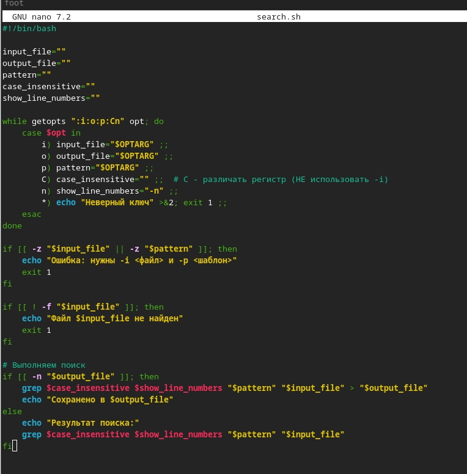
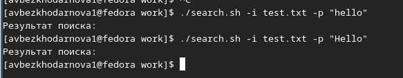
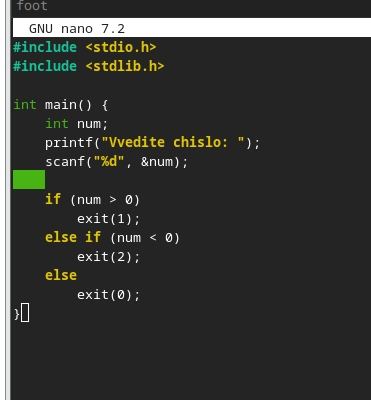
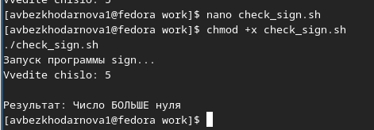
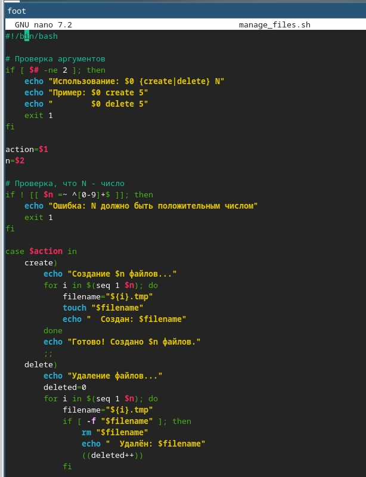
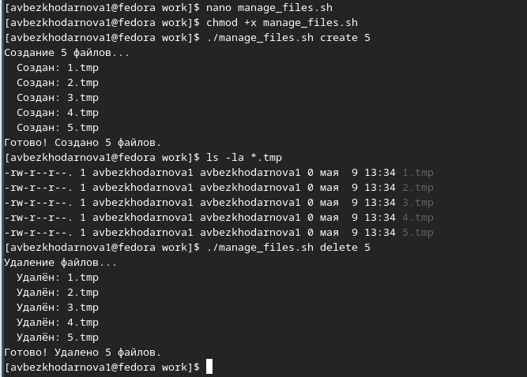
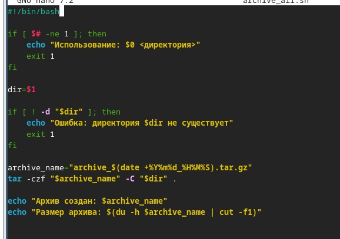
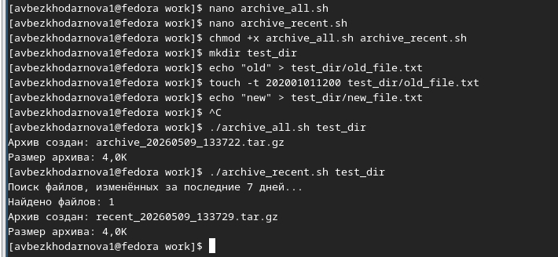

---
## Front matter
lang: ru-RU
title: Лабораторная работа №12
subtitle: Архитектура компьютеров
author:
  - Безходарнова А.В.
institute:
  - Российский университет дружбы народов, Москва, Россия
date: 25  апреля  2026

## i18n babel
babel-lang: russian
babel-otherlangs: english

## Fonts
mainfont: Liberation Serif
sansfont: Liberation Sans
monofont: Liberation Mono

## Formatting pdf
toc: false
toc-title: Содержание
slide_level: 0
aspectratio: 169
section-titles: true
theme: metropolis
header-includes:
  - \metroset{progressbar=frametitle,sectionpage=progressbar,numbering=fraction}
---

# Информация

## Докладчик

:::::::::::::: {.columns align=center}
::: {.column width="70%"}

  * Безходарнова Алиса Викторовна
  * Студентка НКАбд-01-25
  * Алiса
  * Российский университет дружбы народов
  * [1032253545@rudn.ru](mailto1032253545@rudn.ru)

:::
::: {.column width="30%"}

:::
::::::::::::::

# Цель работы

Изучить основы программирования в оболочке ОС UNIX. Научится писать более сложные командные файлы с использованием логических управляющих конструкций и циклов.

# Задание

1. Используя команды getopts grep, написать командный файл, который анализирует
командную строку с ключами:
– -iinputfile — прочитать данные из указанного файла;
– -ooutputfile — вывести данные в указанный файл;
– -pшаблон — указать шаблон для поиска;
– -C — различать большие и малые буквы;
– -n — выдавать номера строк.
а затем ищет в указанном файле нужные строки, определяемые ключом -p.
2. Написать на языке Си программу, которая вводит число и определяет, является ли оно больше нуля, меньше нуля или равно нулю. Затем программа завершается с помощью
функции exit(n), передавая информацию в о коде завершения в оболочку. Командный файл должен вызывать эту программу и, проанализировав с помощью команды $?, выдать сообщение о том, какое число было введено.
3. Написать командный файл, создающий указанное число файлов, пронумерованных последовательно от 1 до 𝑁 (например 1.tmp, 2.tmp, 3.tmp,4.tmp и т.д.). Число файлов, которые необходимо создать, передаётся в аргументы командной строки. Этот же командный файл должен уметь удалять все созданные им файлы (если они существуют).
4. Написать командный файл, который с помощью команды tar запаковывает в архив все файлы в указанной директории. Модифицировать его так, чтобы запаковывались только те файлы, которые были изменены менее недели тому назад (использовать команду find).

# Выполнение лабораторной работы

Создаю первую программу

{#fig:001 width=70%}

---

Делаю ее исполянемой и запускаю (рис. -@fig:002).

{#fig:002 width=70%}

---

Пишу вторую программу (Рис -@fig:003).

{#fig:003 width=70%}

---

Делаю файл исполняемым и запускаю (Рис -@fig:004)

{#fig:004 width=70%}

---

Пишу третью программу (Рис -@fig:005)

{#fig:005 width=70%}

---

И запускаю ее

{#fig:006 width=70%}

---

Пишу четвертую программу

{#fig:007 width=70%}

---

И запускаю ее

{#fig:008 width=70%}

# Вывод

В ходе данной лабораторной работы я изучила основы программирования в ОС Linux. Научилась писать более сложные командные файлы с использованием логических управляющих конструкций и циклов.

# Контрольные вопросы

1. Каково предназначение команды getopts?
Разбор аргументов командной строки в shell-скриптах.

2. Какое отношение метасимволы имеют к генерации имён файлов?
Метасимволы (*, ?, []) используются для шаблонов при генерации списка файлов (wildcard expansion).

3. Какие операторы управления действиями вы знаете
if, case, for, while, until, select.

---

4. Какие операторы используются для прерывания цикла?
break (выход из цикла), continue (переход к следующей итерации).

5. Для чего нужны команды false и true
Возвращают код завершения 1 (false) и 0 (true); используются в циклах и условных проверках.

6. Что означает строка if test -f man$s, i,s, встреченная в командном файле?
Проверяет, существует ли файл с именем, составленным из переменных $s, $i и точками, с экранированием специальных символов.

---

7. Объясните различие между конструкциями while и until.
while выполняет цикл, пока условие истинно (код возврата 0); until выполняет цикл, пока условие ложно (код возврата не 0).

# Список литературы{.unnumbered}

