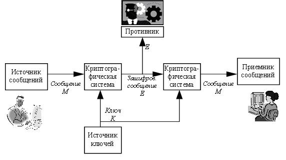
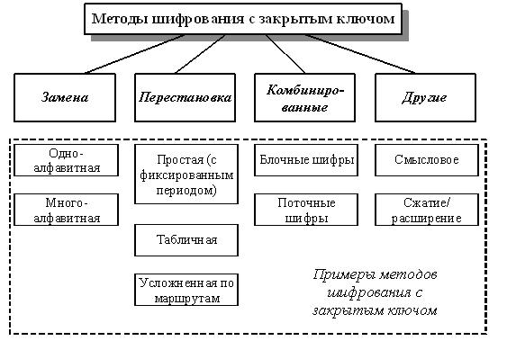
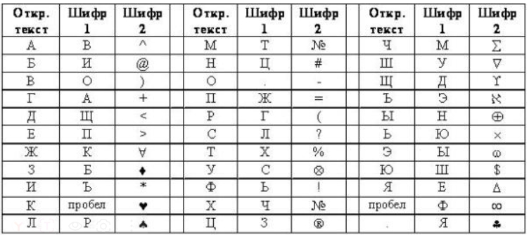
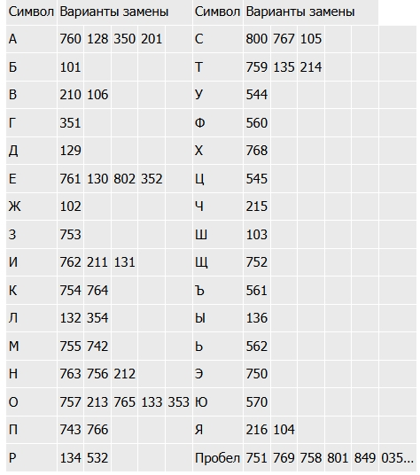
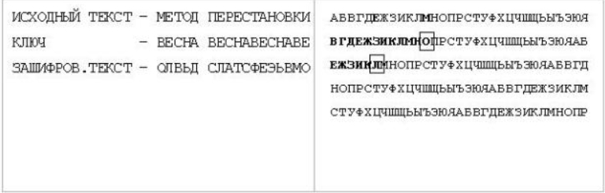
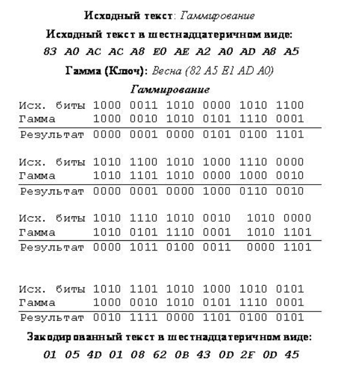
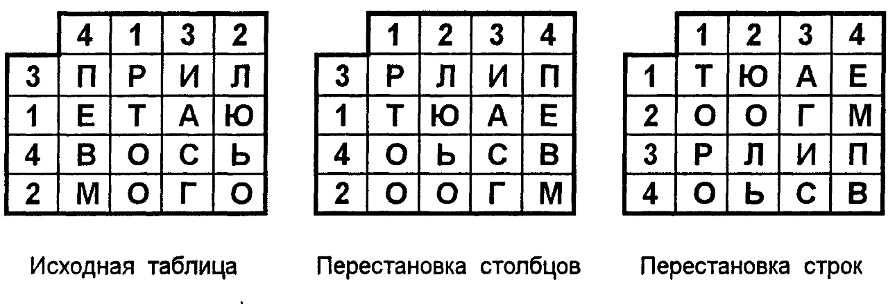

---
## Front matter
lang: ru-RU
title: Доклад на тему Методы криптования на основ закрытого ключа
subtitle: Архитектура компьютеров
author:
  - Безходарнова А.В.
institute:
  - Российский университет дружбы народов, Москва, Россия
date: 3 апреля 2026

## i18n babel
babel-lang: russian
babel-otherlangs: english

## Fonts
mainfont: Liberation Serif
sansfont: Liberation Sans
monofont: Liberation Mono

## Formatting pdf
toc: false
toc-title: Содержание
slide_level: 0
aspectratio: 169
section-titles: true
theme: metropolis
header-includes:
  - \metroset{progressbar=frametitle,sectionpage=progressbar,numbering=fraction}
---

# Информация

## Докладчик

:::::::::::::: {.columns align=center}
::: {.column width="70%"}

  * Безходарнова Алиса Викторовна
  * Студентка НКАбд-01-25
  * Алiса
  * Российский университет дружбы народов
  * [1032253545@rudn.ru](mailto1032253545@rudn.ru)

:::
::: {.column width="30%"}

:::
::::::::::::::

# Введение

Криптография — это наука о методах обеспечения конфиденциальности и целостности информации. Данный доклад посвящён методам криптования на основе закрытого (симметричного) ключа, где один и тот же секретный ключ используется для шифрования и расшифрования.

# Актуальность темы

Симметричное шифрование остаётся наиболее быстрым и широко применяемым способом защиты данных в компьютерных сетях, радиоканалах и системах хранения информации, несмотря на появление более сложных асимметричных алгоритмов.

# Цель работы

ознакомиться с простейшими методами симметричного шифрования (подстановка, перестановка) и их реализацией на основе закрытого ключа.

# Задачи

1. Рассмотреть общую схему симметричного шифрования.
2. Описать основные операции (перестановка, подстановка) и ключевые понятия (открытый текст, шифртекст, имитовставка).

# Схема симметричной криптосистемы

{width=70%}

# Методы шифрования

{width=70%}

# Пример одноалфавитной замены

{width=70%}

# пример пропорционального шифра

{width=70%}

# Пример многоалфавитной замены

{width=70%}

# Метод гамирования

{width=70%}

# Метод перестановки

{width=70%}

# Заключение

Простейшие методы перестановки, подстановки и гаммирования остаются фундаментальными строительными блоками современной криптографии. Переход от букв к двоичному алфавиту и использование алгебры логики (операции XOR) позволили создать стойкие алгоритмы. Закрытые методы (симметричное шифрование) по-прежнему незаменимы там, где требуется высокая скорость обработки больших потоков данных.

# Список литературы{.unnumbered}

1. "Простейшие методы шифрования с закрытым ключом" https://intuit.ru/studies/courses/691/547/lecture/12373?page=6
2. "Защита информации в локальных сетях" https://intuit.ru/studies/professional_retraining/943/courses/57/lecture/1688?page=2 

# Список литературы{.unnumbered}
