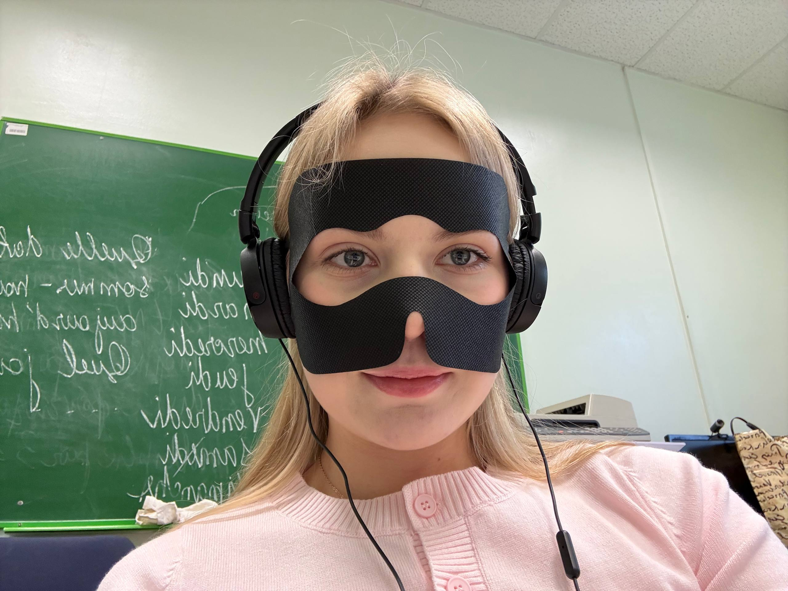
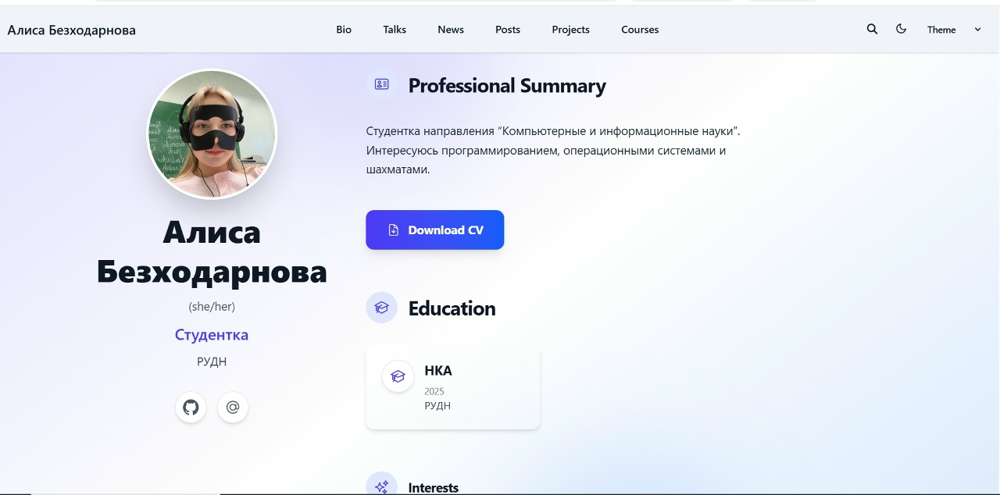
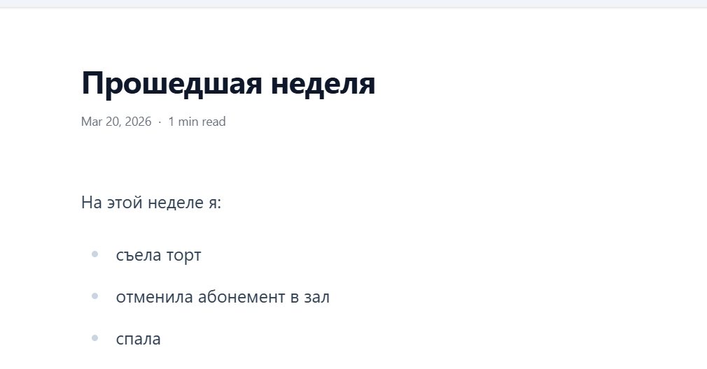

---
## Front matter
lang: ru-RU
title: Индивидуальный проект часть 2
subtitle: Архитектура компьютеров
author:
  - Безходарнова А.В.
institute:
  - Российский университет дружбы народов, Москва, Россия
date: 14  марта 2026

## i18n babel
babel-lang: russian
babel-otherlangs: english

## Fonts
mainfont: Liberation Serif
sansfont: Liberation Sans
monofont: Liberation Mono

## Formatting pdf
toc: false
toc-title: Содержание
slide_level: 0
aspectratio: 169
section-titles: true
theme: metropolis
header-includes:
  - \metroset{progressbar=frametitle,sectionpage=progressbar,numbering=fraction}
---

# Информация

## Докладчик

:::::::::::::: {.columns align=center}
::: {.column width="70%"}

  * Безходарнова Алиса Викторовна
  * Студентка НКАбд-01-25
  * Алiса
  * Российский университет дружбы народов
  * [1032253545@rudn.ru](mailto1032253545@rudn.ru)

:::
::: {.column width="30%"}

:::
::::::::::::::

# Цель работы

Создание собственного сайта с помощью github pages

# Задание

- Разместить фотографию владельца сайта.
- Разместить краткое описание владельца сайта (Biography).
- Добавить информацию об интересах (Interests).
- Добавить информацию от образовании (Education).
- Сделать пост по прошедшей неделе.
- Добавить пост на тему по выбору:
Управление версиями. Git.
Непрерывная интеграция и непрерывное развертывание (CI/CD).

# Выполнение лабораторной работы

На сайт подгружаю информацию о себе и размещаю свою фотографию. (рис. -@fig:001).

{#fig:001 width=70%}

Создаю пост о прошедшей неделе (рис. -@fig:002).

{#fig:002 width=70%}

Создаю пост о о упралении версиями git (Рис -@fig:003).

{#fig:003 width=70%}

# Вывод

В ходе данной работы у меня получилось оформить информацию о себе на своем сайте.

# Список литературы{.unnumbered}

